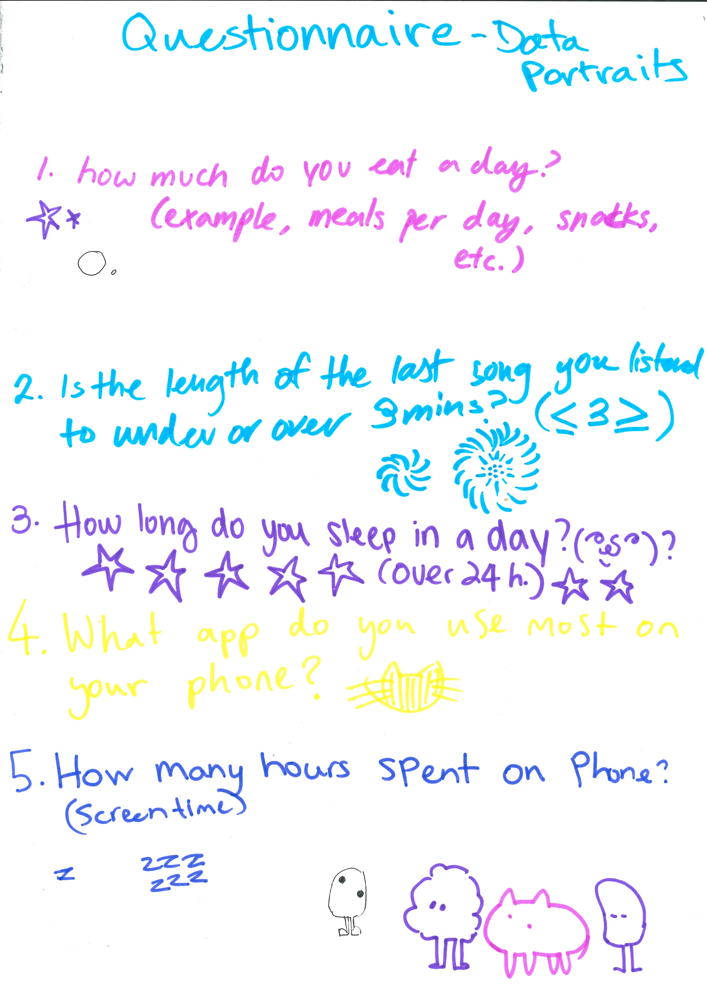
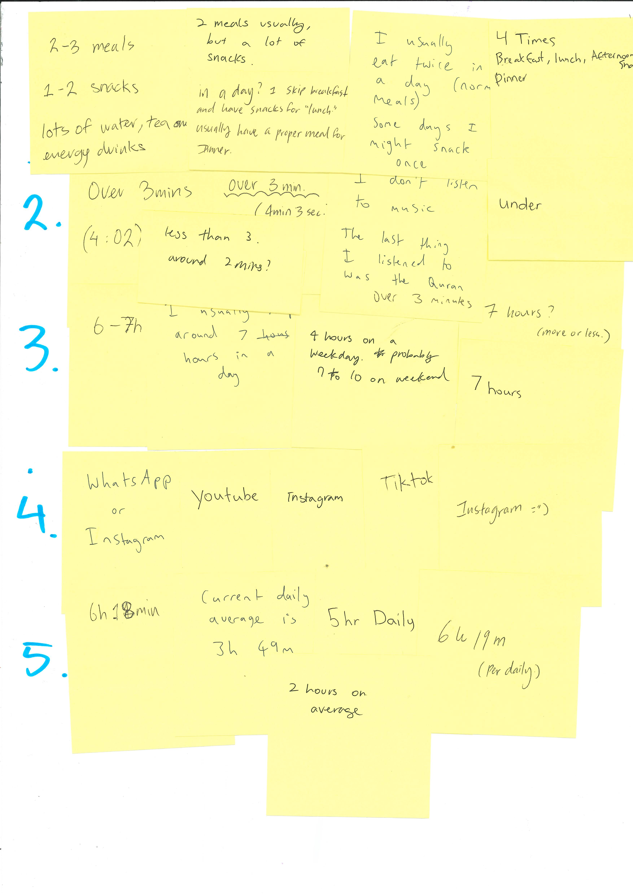
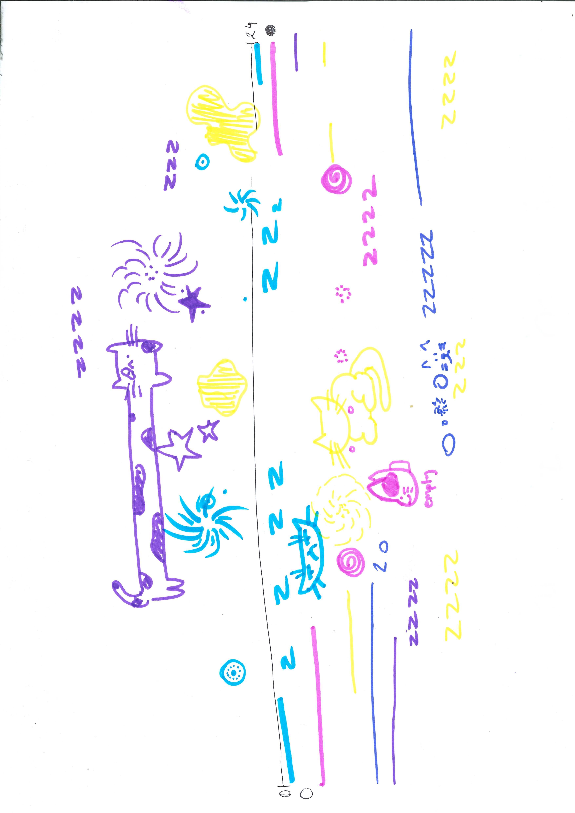
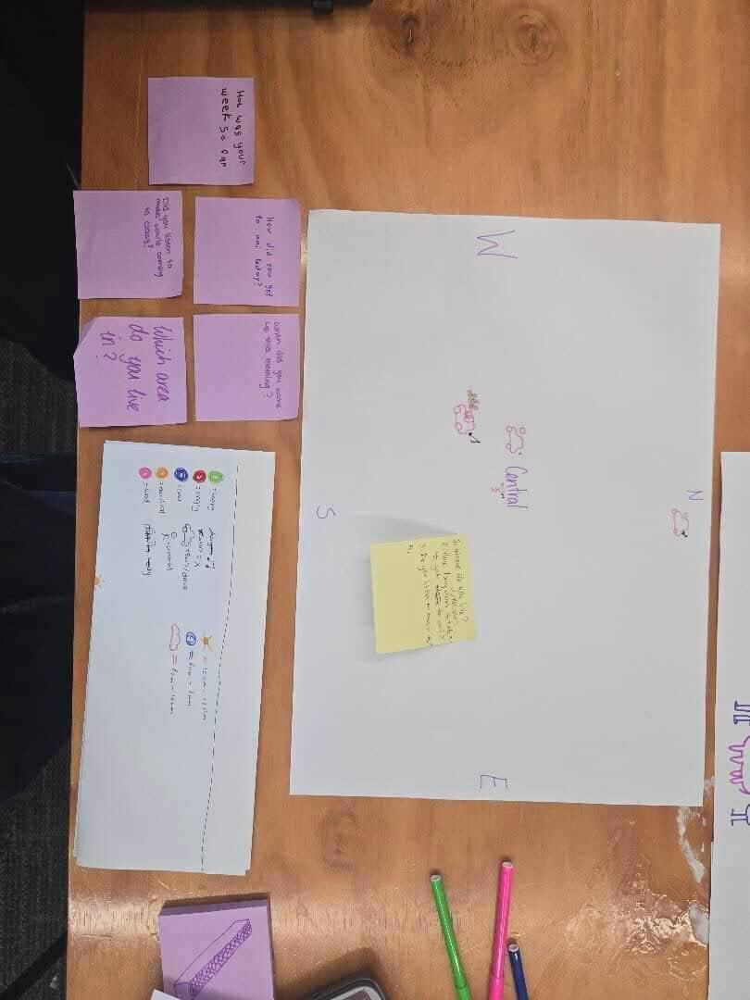
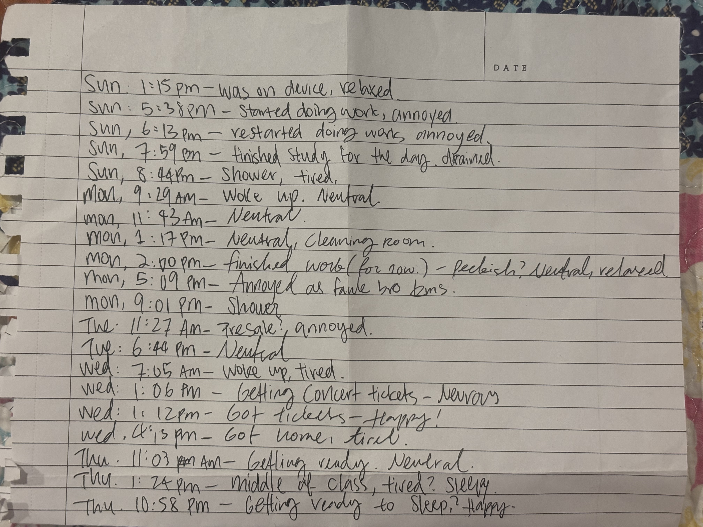

# Week 01

[← Back to Home](../index.md)

## Documentation 

In this week, we worked in a group of 4–5 people, collect personal data from one another and collaborate on a hand-drawn data visualisation to produce a “group portrait” made entirely from data. Groups then swap their portraits and try to decode what each visualisation reveals about the people behind it.

We devised a short questionnaire of 5 questions to ask every member of the group. 

Something we noticed with the question is that it all had a value of time, something to do with a duration. which was interesting. 
we then answered the questions using post-it notes. which remained anonymous.

*Here are the questions we wrote*

*And here are the post-it note answers.*

we then go on to produce a collective data visualisation on a single sheet of paper. using different colored pens to represent each memeber. keeping in mind how data should include empathy and imperfection,

For this, I would say our group struggled with going more abstract when coming to expressing ourselves with visual language. for this isn't meant to look "clean" or neat. and we each decided on shapes and lines that fit the vibe

so something simple we agreed on is, sleep could be a line, screentime could be ZZZs, and music over or under three minutes could be this swirl pattern. and for how much we eat a day, would be just circles or anything you'd like. and finally for what app used the most was a cat of some kind (decided by the prompter ;) we also used different colours to represent each individual.

**we wanted the visualisation of our collected data to look less tally-like, or anything that just screams "this is a data chart". But we did need to take into consideration regarding the unit of the data. as mentioned earlier. most of them has a common time value. so we chose to draw a line across the paper to represent 24 hours. one end of the line being unfilled circle, and the other filled.  we tried to use as minimal text and number as possible.

*the drawing we did to convey our data*

Something I noticed while watching each person draw out their data. most seemed to draw under the first person that went. which lead the page to look "too clean" and the point of the exercise was lost.

We then swapped data with the group behind us, to decode each other's portrait. 

*The other team's data portrait*

First glance, we first noticed that one of the possible questions are, how far does each of their teammate live from uni? (how far are you from auckland central) how do you get to uni? (do you drive to uni?) also do you listen to music while you drive. Something that did end up confusing us is that there is a circle beside the car each teammate drew. another also has a green blob. Which we couldn't figure out if it was a pet? or if it meant food...

Something that I learnt about these people in this group is that some lives close to central, and some lives north from central. most of them drive to uni. and we later found out the green blob means the feeling they had at the time. (green means happy). Nothing really surprised me, we also decoded what the questions were pretty fast on. I think it is a bit hard trying to tell who is who since they are all stick figures in similar colors.

## Independent Data Portrait

This independent data portrait involves a hand-drawn visualisation of personal data collected over several days, by picking out an aspect of my daily life that I am curious about but don't normally pay close attention to. This is then observed and record by hand over the course of 4–5 days.

I wanted to do "everytime I check the time" as the topic. I would record when I check the time and what I was doing in the moment of that. (if I was happy, stressed, annoyed, etc.)

Since I was home most of the week, I just recorded out of a page of a notebook. This was recorded over the course from Sunday all the way to Thursday. 

I chose to record the time, what I was doing, and how I was feeling in the moment. It started out okay, I was doing uni work, and I noted how I am annoyed, or felt neutral, or relaxed. I realized now finished the collecting part. I was mostly neutral, which was surprising (considering I am a very emotional person) There were parts where I was stressed out about assignments, or that there was an event I was excited about. 

I also realized that the more I started to record, the more it becomes a conscious thing. And the collection begun to be more frequent.

I started to think about how I wanted to visualize my data. I knew I wanted to use star shapes to mark each time I felt something. using scale as part of expression. 
