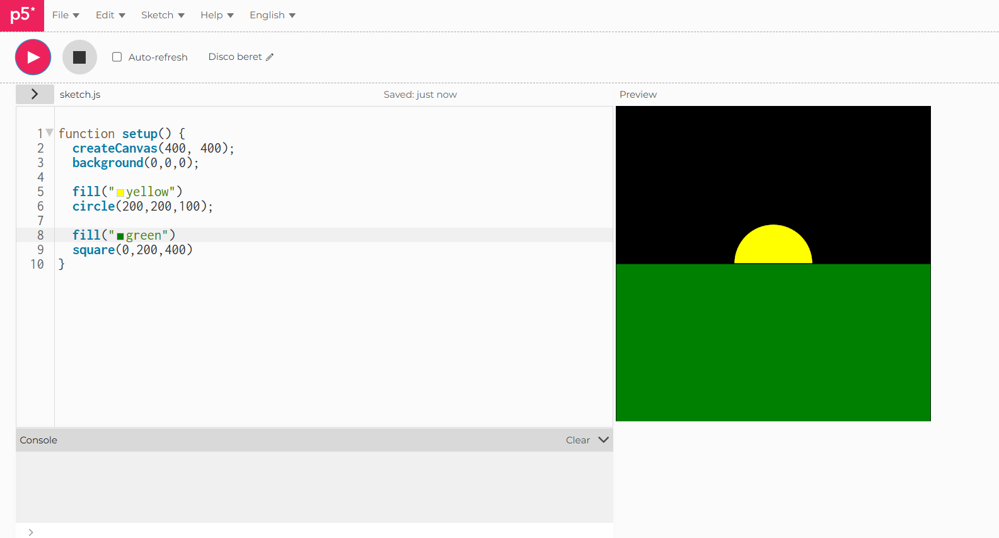
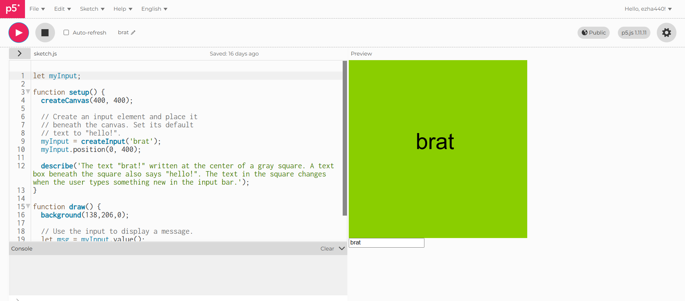
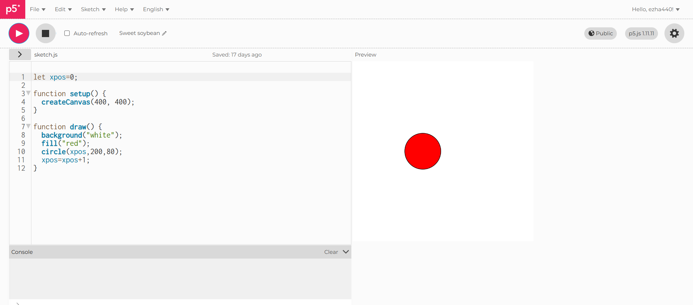
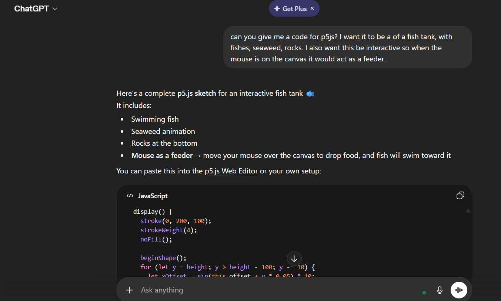
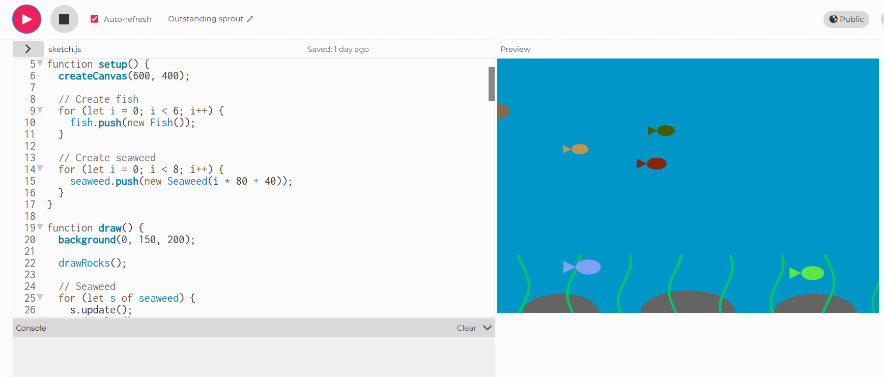
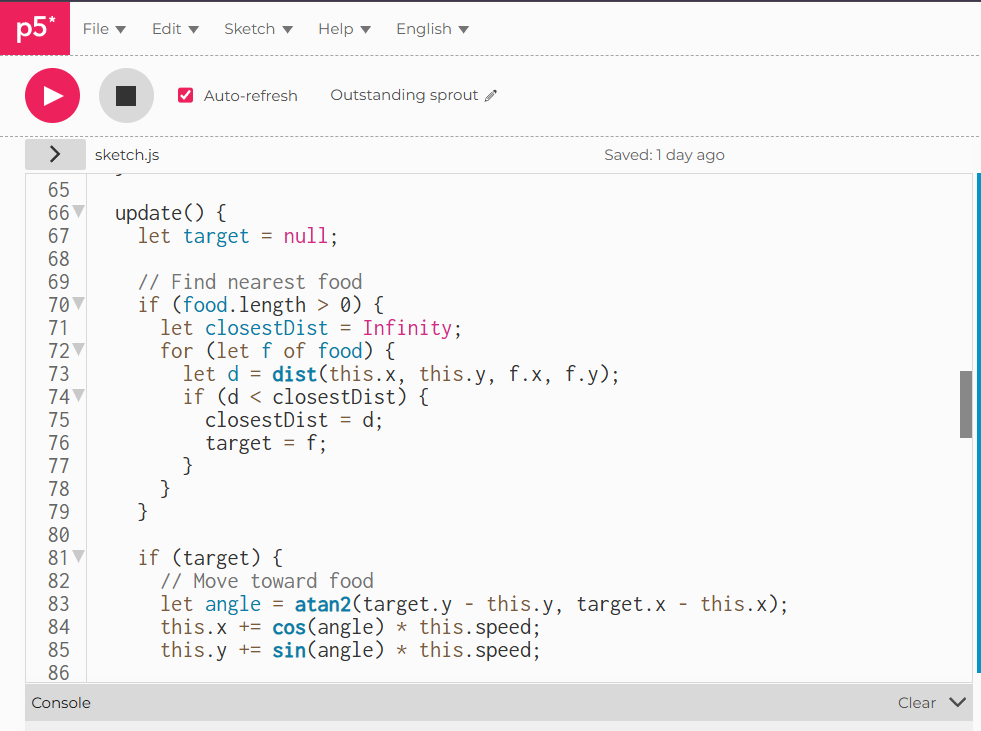
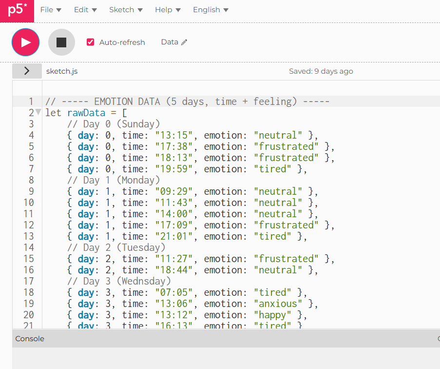
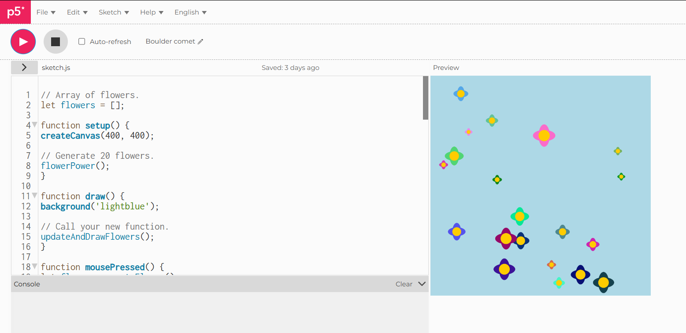
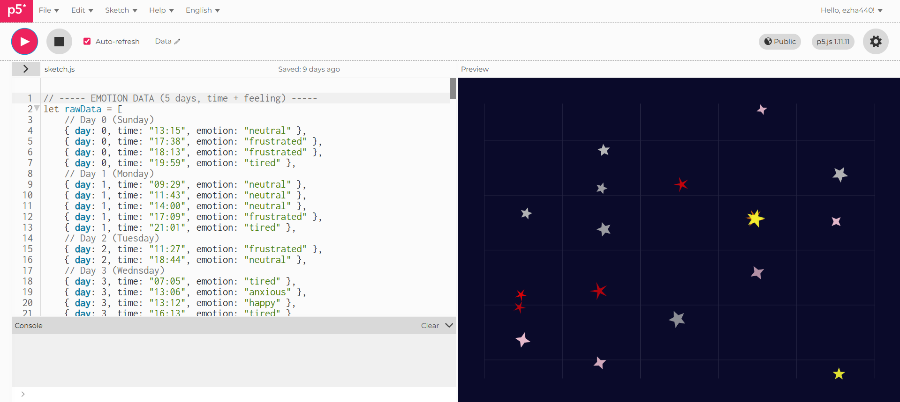

# Week 02

[← Back to Home](../index.md)

## Documentation 

For this week's learning, we started with sharing our data portrait with our peers, Although I haven't started actually drawing my design. 

Something I have learned from the lecture is that when planning the data portrait it is important to keep in mind that the visualisation should changes based on what people do, The experience of engaging with the data is part of the meaning, and the physical materials and space shape how people encounter information.

We start to look at p5.js, which is a JavaScript library designed to make coding accessible for artists, designers and beginners. It runs in the browser, and it has built-in tools for creating interactive elements. They also provide a reference for the codes which I find really helpful since I've never done any scripting.

I learnt about the function setups, what codes to input, and it was really helpful having peers who knows how to script. The in class activities helped me grasp certain tools that are offered in p5.js. from a stationary image to a moving animated one is very interesting. 

# In Class Activities

This was one of the first experiment I did, this allowed me to create three different shapes. I struggle a bit and the codes started to blur into one another. My peers helped to through understanding why the function works, how it works, how to center the circle and how to change color, So if the canvas is 400x400, then the circle would be positioned 200,200,100 so its centered!

I also played around with creating a input. This helped me practice where to center the text. 

We also looked at making an interactive sketch with at least two DOM (Document Object Model) elements that control something on the canvas. In this case, I create a simple red dot, if I wanted it to move horizontally, I would type in the input "xpos=xpos+n"(so the X-position) of the shape in canvas. the "n" in this instance would act as the speed of how fast the dot would travel. So if I put in 1, it would move at a slow pace, and if I put through 20, it would move faster across the canvas. 

we are then introduced to "vibe coding". meaning building software by describing what you want in natural language, using an LLM to generate the code. So describing clearly what you want to happen, read the code that comes back, test it and refine the description.

As per class activity, I went to chatgpt to help me build a more complex sketch in p5.js. I asked chat to give me a code for p5js,  "I want it to be a of a fish tank, with fishes, seaweed, rocks. I also want this be interactive so when the mouse is on the canvas it would act as a feeder."

It created a simple scene with fish, seaweed, and if the mouse hovered over the canvas it would act as a feeder, and the fishes would go after the food that is dropped, while also swimming in and out of the frame. Which I think its pretty cool. 

Somthing I learnt through this would be how to make codes with better interactions. So instead of having just one object move, I could work a scene. In this function that I used Chat for, It made so not only does the fishes move, so does the seaweed. Also how fish detect and move towards the nearest food using distance calculations and angles.

We also looked at Github for the first time, which is a web platform that hosts Git repositories online, making it easy to store, share, and collaborate on projects. 

There is also the option to customize the websites. Which is something I definitely want to look into later on.

## Independent Study
I translated my data into code, and settled on what I wanted to do for the live data portrait. 

I mostly settled on the time and emotions from the days. And because it is needed for the data to be interactive, I take inspo from the "data structure garden". I liked how the flowers moved and it was fun to click onto the canvas as an interaction.

I used vibes coding for my data portrait. I used DeepSeek to help me breakdown parts of the structure coding down for me when I didn't understand how or why that function works. I also tried changing some of the data to see what would change. 

