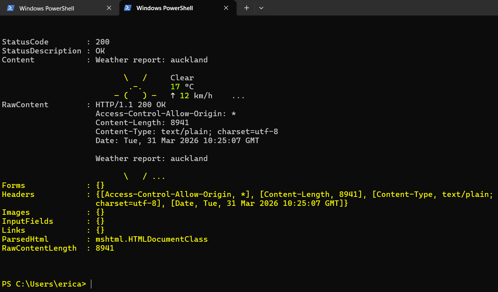
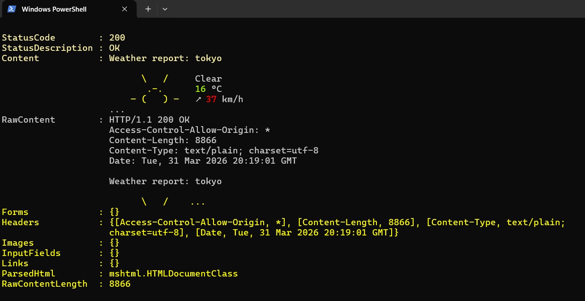
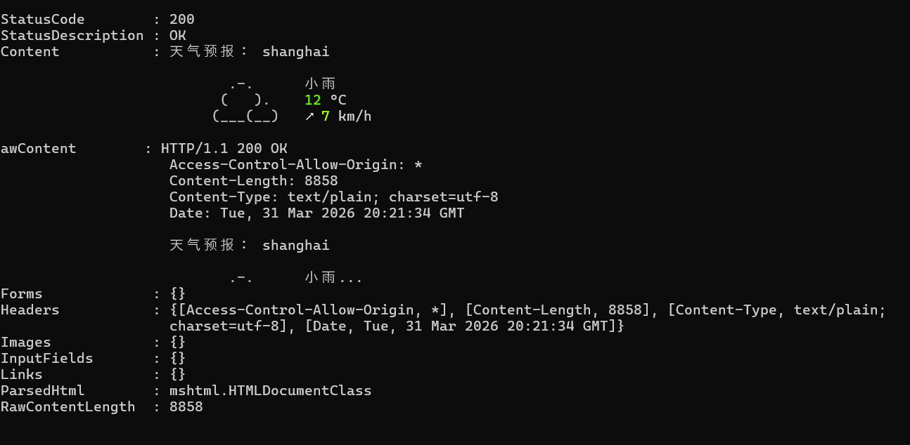
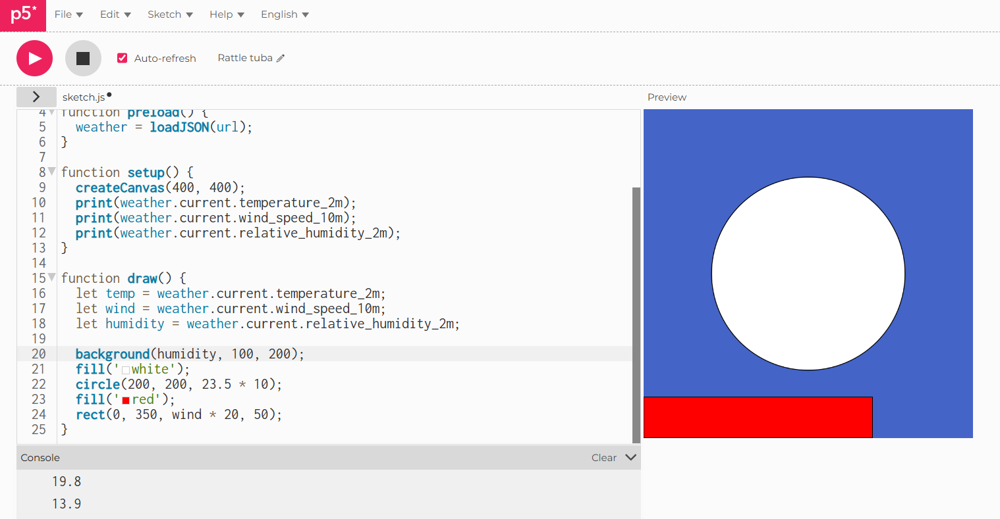
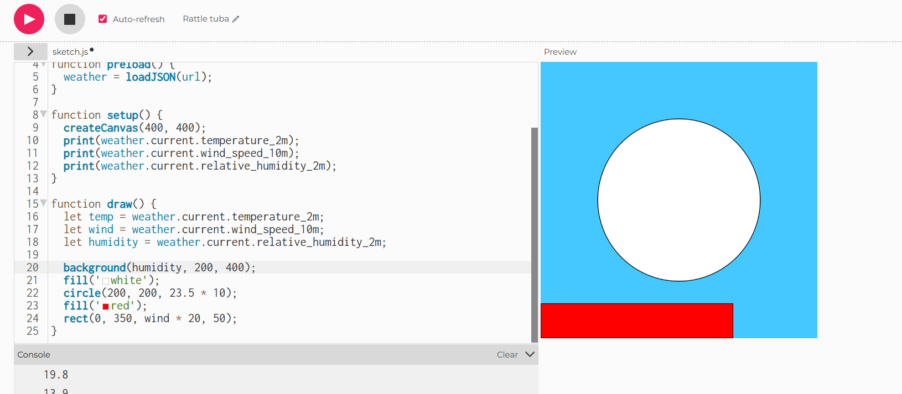
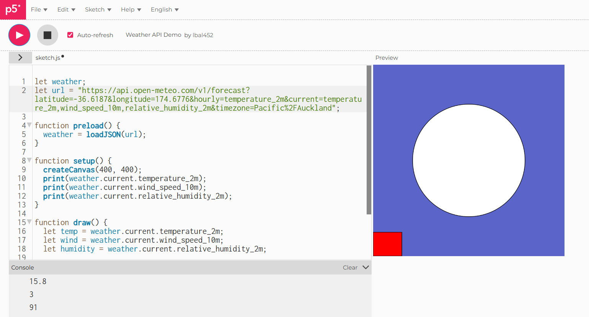
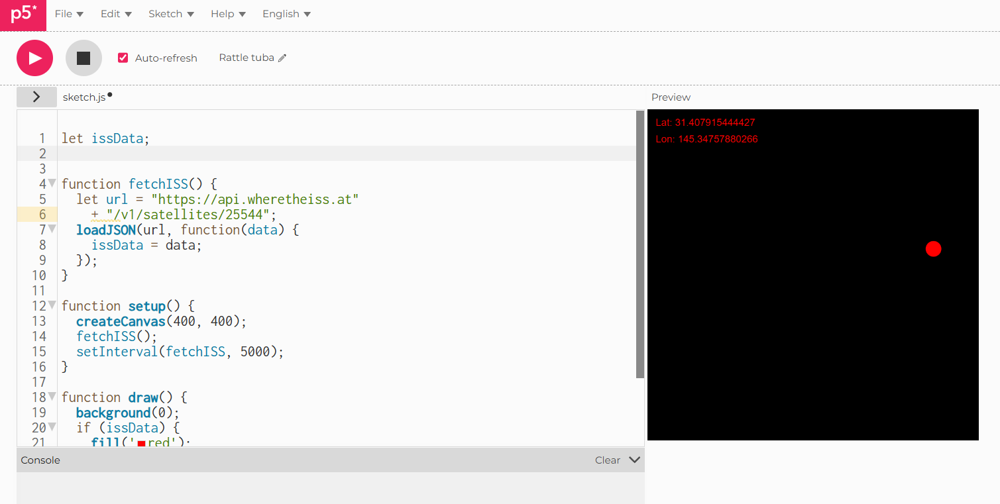
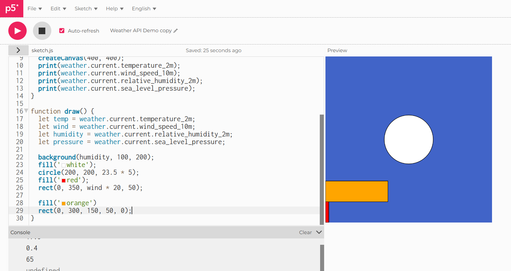

# Week 03

[← Back to Home](../index.md)

## Documentation 

For this week, we start off with sharing with our peers what we did for our interactive data portrait. I did talk about wanting something stars related in week 1- once I have processed all of my data. I knew I wanted the stars to be interactive, or at least have different shapes to distinguish what data its expressing. Using colors, sizes, etc. 

I haven't started yet during this time. But I looked at my peer's work which gave me more inspiration on what to do. Another example I looked at was the "data structure garden" on p5.js website. I really liked how the flowers "bloomed" and when you go to click on the canvas it would generate new ones. I also understand that the data portrait should be more interaction based, and also that it shouldn't include text and have a more abstract apporach to expressing. 

# In class activities

Through digital and analogue approaches, explore how to access, filter, and translate live data into visual and material forms. These activities build on the coding fundamentals from Experiment 2, while also introducing analogue practices rooted in rule-based and generative design.

We explored with curl, which is a free and open-source command line tool for transferring data over the Internet. Allowing user to send a request to a web address and shows what comes back. We worked with live data, an example being looking at the weather here in auckland. 

Also places like Tokyo and Shanghai, I have also managed to explore and change the languege of which the data pops out on. 

Tokyo weather 

Shanghai weather

I found this very interesting since its all worked in the windows terminal. I did however struggle with finding the moon phases and synonym. 

I also looked at how to draw with the weather, using a specific code I could see how the drawing change. 

This is what the original code looks like, 

And this is after I changed some numbers, which makes the color lighter. I also tried putting through my own codes. which didn't work as a function and I couldn't figure out why. It irratated me alot. 

**UPDATE**

I actually did figure it out. I may be slow. 

I noticed that it wasn't about the numbers but to reset the the latitude and longitude in the weather forecast API, and reselected the current temp, current humidity and current wind. 

The area set to Silverdale, in auckland 

I couldn't figure out how to add ranom() and noise() function to the code. So I with the help of vibe coding, and this is what I got:

which made it look really funky while it moved. I could also change the timeoffset to make it faster.

Besides this, I looked at ISS Tracker, this sketch calls the API every 5 seconds and updates a dot and text on the canvas.

## Indenpendent study

For my indenpendent study, I wanted to see what the weather is like in Shanghai, so I started looking in open meteo. I changed the latitude and longitude to Shanghai, China and reset the timezone to auto detect. Then I picked out the variables, being current temp, relative humidity, wind speed, and sea level pressure. 

I was able to use what I leanrt in class to add Noise() to the original function.

### **How does my map data values to visual properties (colour, size, position, shape, movement)?**
##
The model uses a combination of direct data to map data to visual propertie. For Colour,The background is mapped to humidity.

'background(humidity + noiseHumidity, 100, 200)'

The red value is derived from the current humidity percentage plus a noise offset. As humidity increases, the red rectangle shifts due to the offset. Regarding size, The central circle’s size is mapped to temperature.(so in this case, 20.5c)

'circleSize = (20.5 + noiseTemp) * 10;'

Temperature directly controls the scale of the circle. A higher temperature results in a larger circle.

Position is static in this sketch. The circle remains at (200, 200), and the rectangles remain fixed to the bottom edge. it's not yet mapped in the data for it to shift, maybe sometimes in the future. Shape is also static. The visualization always uses a circle and rectangles. However, the length of the rectangles is mapped to wind speed.

This model introduces simulated movement through Noise() rather than real-time data updates.

'timeOffset += 0.01;'

While the API data is static (called once in preload), the visualization "moves" by adding noise offsets to the temperature, humidity, wind, and pressure values. This creates a smooth, organic flow in the visuals that mimics the rhythm of changing weather, even though the actual data points remains the same.

### **What does the visualisation reveal about the data that numbers alone cannot?**
##
Numbers alone tell the specific value (e.g., "humidity is 65%"), but this visual reveals relationships and context.By mapping humidity to the background color, temperature to the circle size, and wind speed to the length of a rectangles, the viewer can immediately see which variable is currently "dominant." If the circle is huge but the bar is short, the viewer understands it is a hot but calm day without needing to read numeric values.

The introduction of Noise() suggests that the weather is not a static number but a fluid system. Even though the underlying data doesn't change in this specific code, the visualization implies that real weather fluctuates subtly around a baseline.

### **How does the sketch change over time? What is the relationship between the data's rhythm and the visual rhythm?**
##

The sketch changes through continuous, smooth fluctuations driven by timeOffset. Because timeOffset increments in draw, the noise() values drift slowly, causing the circle to subtly expand and contract and the wind bars to lengthen and shorten rhythmically.

In this code, the data is static. Once the API is loaded in. The values for temp, wind, humidity, and pressure do not update over time. Therefore, the real rhythm of the data (the actual changes in Shanghai’s weather) is absent. This means the visual rhythm is artificial and generated by the Noise() code. It creates a "breathing" or "waving" rhythm that is independent. 

The code assumes that weather has an organic rhythm. So it uses noise() to simulate what the rhythm of the data would look like if it were to update in real time. The noise provides a visual but there is no actual relationship between the actual measured rhythm of the weather in Shanghai and the rhythm of the visualization.

To actually have a relationship between data rhythm and visual rhythm, the code would need to fetch new data periodically, allowing the visuals to respond to the real world measure of weather changes.

