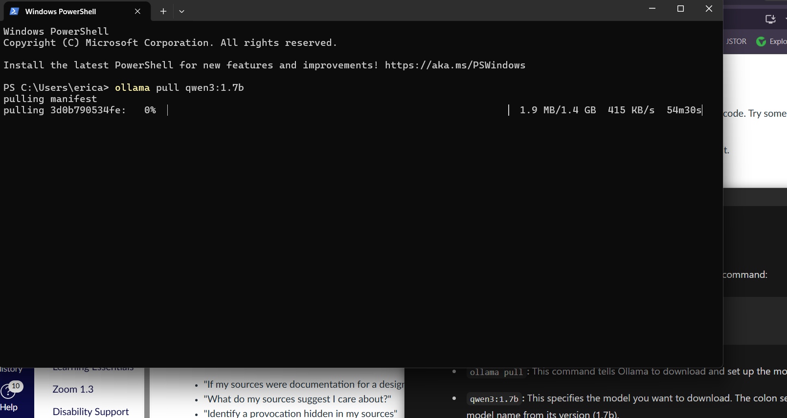
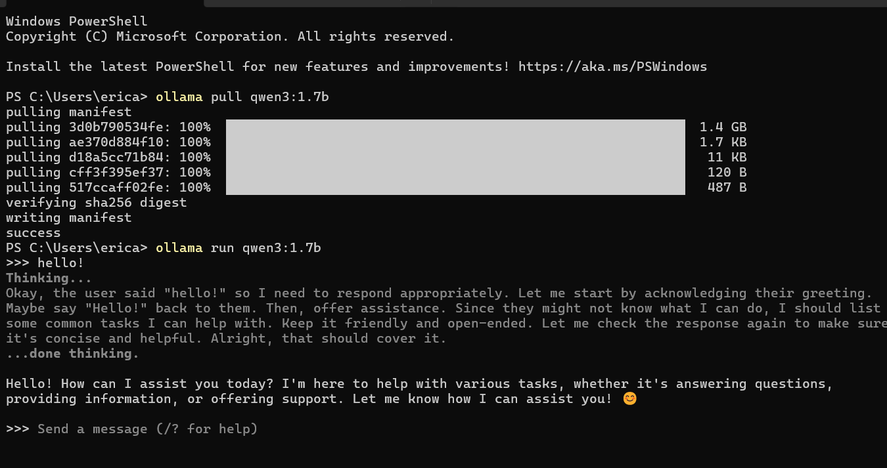
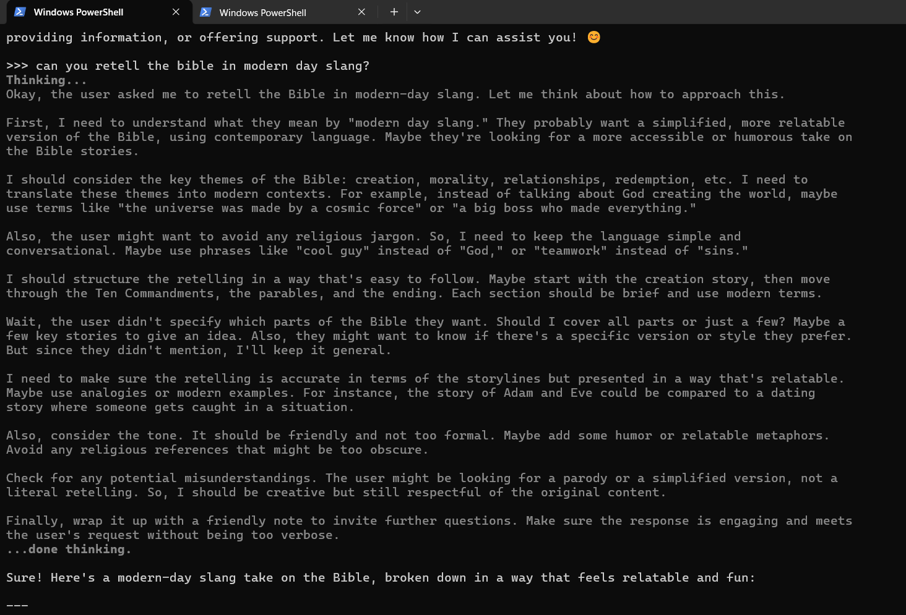
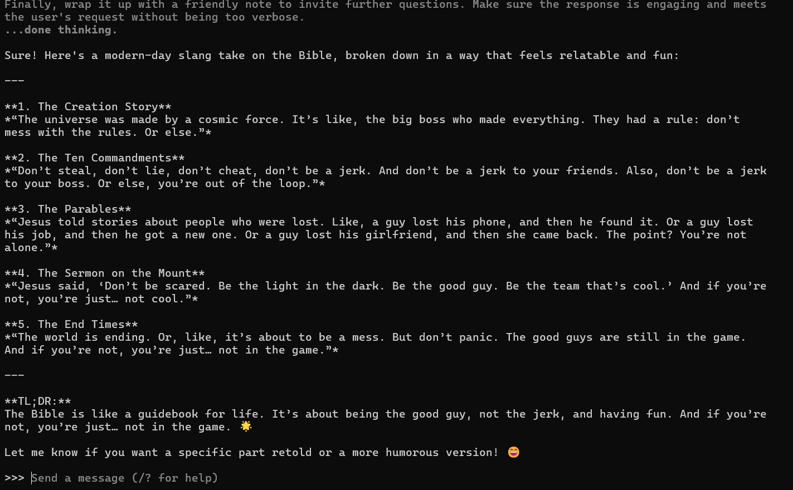
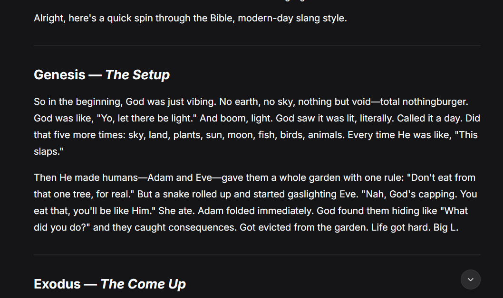

# Week 04

[← Back to Home](../index.md)
## Documentation 

This week, We focused on Artificial intelligence. Exploring local and cloud-based AI workflows. These activities introduce the practical and ethical dimensions of working with AI, building on the ideas about data representation from previous experiments.

we looked to download Ollama, which is an open souce tool designed to run LLMs directly onto local machines. It simplifies the process of downloading, setting up, and running AI models, making it easy to use AI without needing cloud services, thus ensuring data privacy and offline capability. 

We set ollama up with terminal, 

After downloading the right one, I start playing around. 

I asked it to “retell the bible in modern day slang?”

This is interesting to see because it shows the thinking process of the AI. It takes key themes into consideration, which parts of the bible to tell, how to make it easy for the user to understand. It's almost like how we go though design toolkits and the process of making something. 

It then shows me the final product. which consists of the creation story, the ten commandments, the parable, the sermon on mount and the end times. Although the slangs are outdated this was entertaining to see.

**“The world is ending. Or, like, it’s about to be a mess. But don’t panic. The good guys are still in the game.
And if you’re not, you’re just… not in the game.”**

--Ollama, on modern day bible

In comparison to any other AI that is out there, I put the same prompt in Deepseek to see what I'm given, 

which is...boring. And its more updated with the more modern day slangs. If I were to compare these two, It would feel like ollama is more innocent than Deepseek lol. I mean they are both corny as hell but some how deepseek is worse. 

## Images & Media

*Use the format below to embed images from your assets folder:*

``
`*Your caption here*`

*The text inside the square brackets is alt text (a description for accessibility), not a visible caption. To add a caption, place a line of italic text below the image.*

## AI Usage Statement

*Document any use of AI tools under an AI Usage Statement heading. Explain which tools you used and describe how you used them. Reference any AI-generated content (see [QuickCite](https://auckland.libguides.com/referencing-generative-ai-tools) for guidance).*
