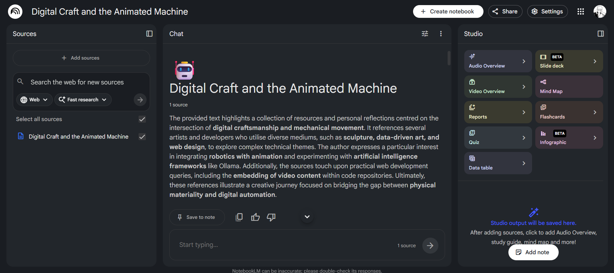
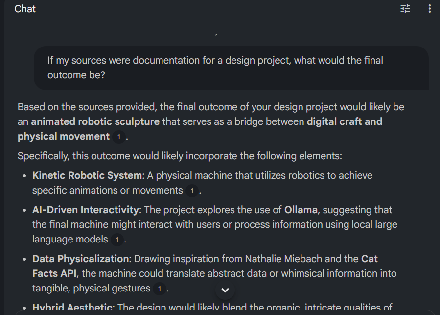
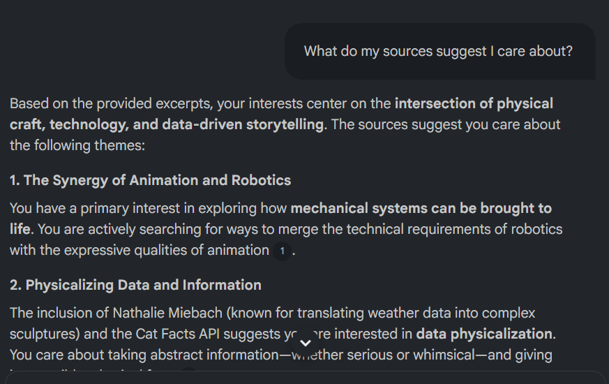
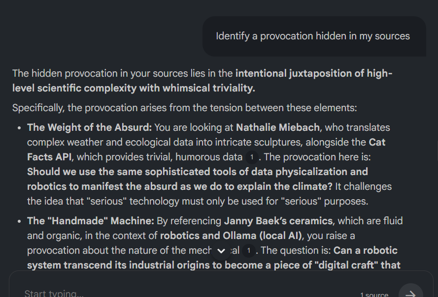
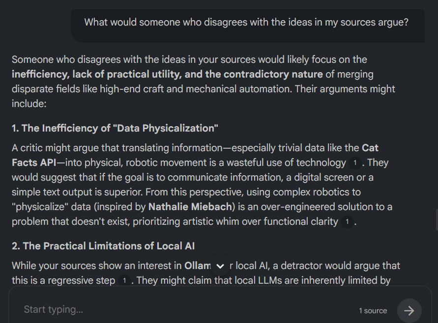
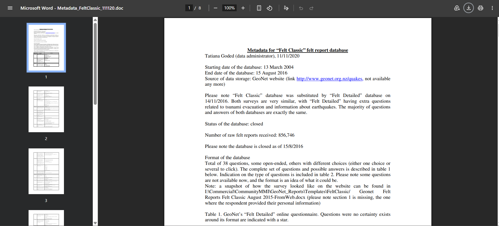
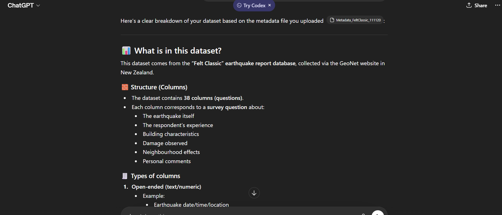
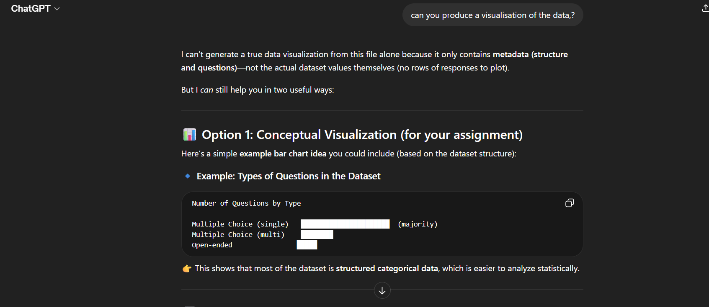
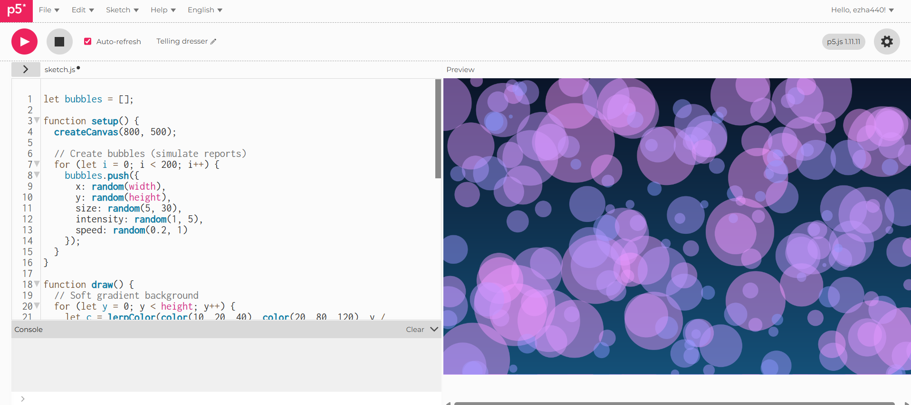

# Week 04

[← Back to Home](../index.md)
## Documentation 

This week, We focused on Artificial intelligence. Exploring local and cloud-based AI workflows. These activities introduce the practical and ethical dimensions of working with AI, building on the ideas about data representation from previous experiments.

we looked to download Ollama, which is an open souce tool designed to run LLMs directly onto local machines. It simplifies the process of downloading, setting up, and running AI models, making it easy to use AI without needing cloud services, thus ensuring data privacy and offline capability. 

We set ollama up with terminal, 

After downloading the right one, I start playing around. 

I asked it to “retell the bible in modern day slang?”

This is interesting to see because it shows the thinking process of the AI. It takes key themes into consideration, which parts of the bible to tell, how to make it easy for the user to understand. It's almost like how we go though design toolkits and the process of making something. 

It then shows me the final product. which consists of the creation story, the ten commandments, the parable, the sermon on mount and the end times. Although the slangs are outdated this was entertaining to see.

**“The world is ending. Or, like, it’s about to be a mess. But don’t panic. The good guys are still in the game.
And if you’re not, you’re just… not in the game.”**

--Ollama, on modern day bible

In comparison to any other AI that is out there, I put the same prompt in Deepseek to see what I'm given, 

which is...boring. And its more updated with the more modern day slangs. If I were to compare these two, It would feel like ollama is more innocent than Deepseek lol. I mean they are both corny as hell but some how deepseek is worse. 

We also looked at NotebookLM, which is a Google-powered AI research and note-taking tool that uses Gemini 2.0 Flash to analyze uploaded documents, including PDFs, Google Docs, and websites. It grounds its answers specifically in your provided sources, reducing hallucinations and allowing users to create summaries, Q&As, study guides, and audio overviews.

In my NotebookLM, I provided a link to my blog, a website about  Nathalie Miebach, An API about random cat facts, and a recent project I was interested in, made by an artist named Janny Baek. I also wrote about 
- The experiment you found most interesting, and why 
- A theme or idea you keep coming back to
- Something you’re curious about but haven’t had a chance to explore yet

I also asked the chat questions about my resources, 

I found it interesting because it goes through only what I have fed it, (so all the info about what Im interested in) and it provided insights and suggestions to what I could possibly do. Instead of adding outside resources, which usually can be unrelable. I think this is a good tool to help when you are stuck at a block when looking at what to design. I would like to do more experiments with this later in the future. 

## Individual Study
For this week's individual study, I chose a public dataset about life in Aotearoa New Zealand and use cloud-based AI tools to explore, interpret, and represent the data. The challenge is to go beyond a single prompt, working through sustained dialogue with the AI, directing its decisions, and critically evaluating its outputs.

I found one on catalogue.data.govt.nz called "Felt Classic". A 38 questions survey to describe the respondent's experience during an earthquake in New Zealand. This dataset is based on paper questionnaires. This database was closed in 2016 and substituted by "Felt Detailed" database, currently ongoing.

Then I put it through ChatGPT, asking it to explain what is in the dataset: what the columns mean, what the values represent, how much data there is, and what is missing or incomplete.? along with What stories might this data contain? What questions could it answer? What biases or gaps are present? Who collected this data, and for what purpose?

It broke down each question with short summerized answers. 

The “Felt Classic” dataset is a large collection of 856,746 self-reported earthquake experiences gathered in New Zealand between 2004 and 2016. It consists of 38 survey-based columns, including a mix of open-ended responses, single-choice, and multiple-choice questions covering earthquake details, personal experiences, building characteristics, and observed damage. The values mainly represent subjective human observations, such as perceived shaking intensity and damage levels, rather than scientific measurements. While the dataset is rich and useful for understanding how people experience earthquakes and how damage varies across environments, it has several limitations: some questions and formats are missing or changed over time, many responses include “don’t know” answers, and the data is biased towards people who chose to report their experiences. Collected by GeoNet to support earthquake intensity analysis and public safety research, the dataset can reveal patterns in human perception, building resilience, and disaster impact, but must be interpreted carefully due to gaps and inconsistencies.

Then I asked it to create a visualization of the data, 

It gave me graphs and texts, but I wanted to see more, so I asked to give me a code for p5.js. I asked it to specify the form, the visual encoding, the audience, the story you want to tell. Iterate through at least three distinctly different representations of the same data. 

here's what I got back, 
.png)
.png)
.png)

It has provided me three different types of codes in p5.js.

I noticed that AI defaulted to having a generic graph as a first option for "data". the same boring font, color, layout. all three have the same generic feel to it. 

So I asked it to make it more fun and no text, 

I was pleasently surprised! the bubbles not only look better, there is no text, and it moves. the bubbles animated so they float up. Although the color looks the same to the previous ones. It actually more pleasing now? 

I think an assumption the AI made about the data and audience is that it went for something that is more commonly used in a serious setting. something commercial, the classic graph and dot chart, and something that is more commonly seen when you google or search for "data". 

I really liked the bubble representation of the data, just because I was expecting more ugly, boring looking graph, but this was actually really cute and *bubbly* (sorry) I also think the colors worked really well with eachother despite it was used in the stacked graph earlier. 

Something I would do differently if I were to build this without AI would be making it interactable, although the bubbles are cute they just kinda float. And I fear it's not exactly related to what the data is originally about. I think there should be a better visual representation of the data. Perhaps more game like? 