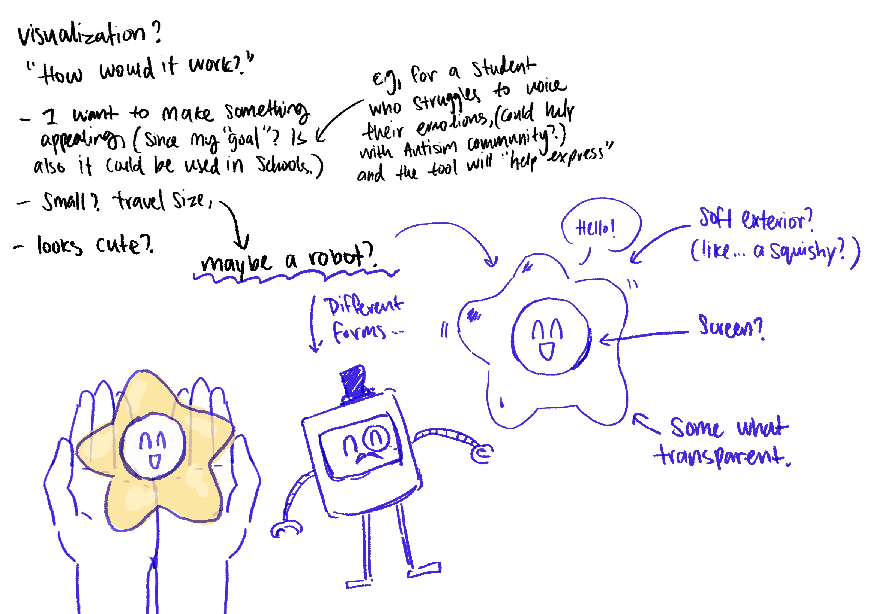
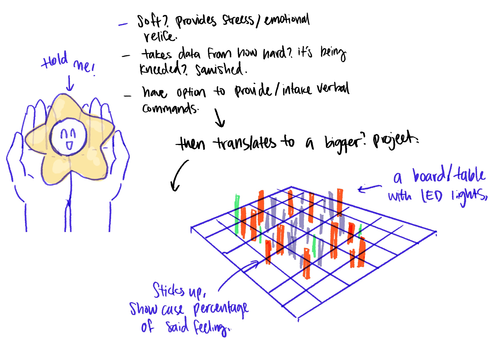

# Week 05

[← Back to Home](../index.md)

## Documentation 

For this week, we looked at writing a reflective proposal, and looked back at what we have did these past few weeks in our making journal. 

## Reflective Proposal
The data portrait was my favourite of all the experiments we did. Before this class, I had never worked with data before, so some parts were hard and frustrating. But I really liked the option to vibe code, and the data portrait's freedom of expression made it feel more personal than just technical. I was most interested in seeing how lines of code could be turned into a picture. It's really satisfying to see the code work. As an example, the data portrait. It's important to tell a story with code, creating a picture for the viewer that feels like a story.
Before I skimmed the materials, I didn't know what terms like "data humanism" or "data sovereignty" meant. After that, I'd like to learn more about data physicalization and data humanism. I like the idea of making data tangible and focused on people better than abstract visualisations. I've been pretty safe during all of the experiments so far. Not pushing for more abstract or complicated things. That mostly fits with what we learned in class, but I want to push myself harder to think about the readings and discussions in the future.

**Which ideas and approaches will I carry forward?**

I'll keep in mind that data doesn't have to be cold. Giorgia Lupi said, "When you work with data, you have to come up with ways to turn the abstract and the uncountable into things that we can see, touch, and connect to our lives and actions." That's exactly what I want to do. I want to look into human feelings in particular. We have a lot of feelings that can't be put into just sadness, anger, or happiness. My possible future scenario: a tool, maybe a physical object or something we wear, that helps us understand and see what we're really feeling. Could this be put in schools, colleges, or places of work? Would that be considered therapy? 
The best data source would be real and live. It could be biometric or self-reported emotion tracking, but it could also work with existing datasets. I want to use data physicalization to make sense of the data. This could be something that looks like brain waves or quick mood changes. My project would show how quickly and easily emotions change, making that rhythm visible and real.

Here is what I think my idea could look like:

I had two ideas in mind, so one is acting like a sensor, while the other would “express” it into a physical data, it would be a board of LED lights that would pop up, creating pattern and color to show what exactly each person is feeling. And this would update over time, so it would move and reconstruct itself. The purpose of this experiment is to showcase how each person feels, that there is diversity in human feelings. 
Now looking back, I think it would be more interesting to have the user/ audience customize their own color for their specific feeling, (put in a code that translates to RGB color wheel?) 
I want my audience to have fun, to experience and experiment with what I have provided, to see human connection through emotions. 

