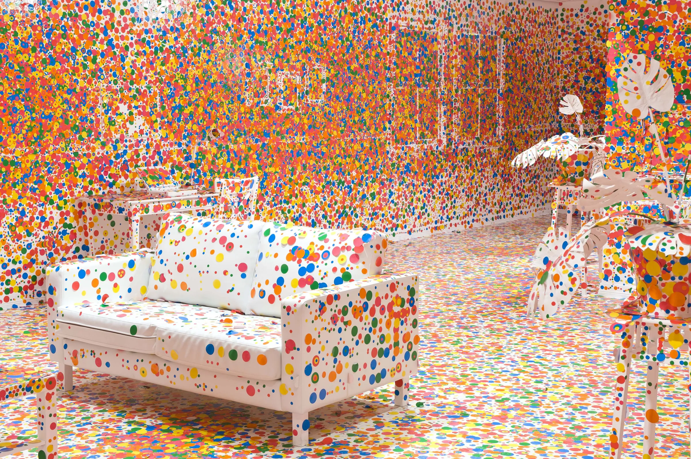
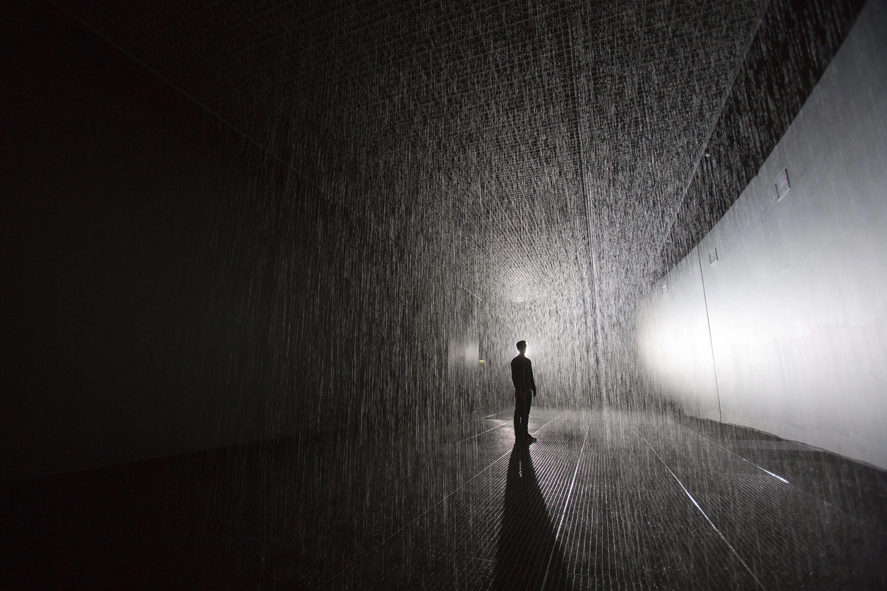
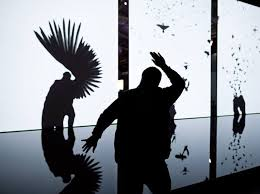

# Week 06

[← Back to Home](../index.md)

## Documentation 
## In class activities
## **1. Data Exploration**

This first activity is about locating, accessing/producing, and examining your intended data source(s).

If your dataset exists already, download or access it and spend time exploring its structure: **what fields does it contain, what format is it in, what are its limitations or gaps?** You might use AI to help you explore or query your dataset. If the data needs to be collected or simulated, begin sketching out what the collection process would look like and what the resulting data structure might be.

Produce a short written audit in your journal covering:

- What the data source is and where it comes from
- What the data contains and how it is structured
- Any limitations, biases, or gaps that you notice (or anticipate, if the data is to be collected or simulated); and what these mean for your project direction

For my project, I want to focus on self- reported data, 
## **What is self-reported data?**

Self-reported data is a research method where participants directly report their own behaviours, attitudes, or experiences through surveys, interviews, or diaries. It is widely used in psychology, health, and marketing for its efficiency and ability to access internal perspectives. However, it is prone to bias, including social desirability and recall issues.

This data is typically collected by government statistical agencies (like Stats NZ), academic researchers, health organisations, or market research firms. The data are usually structured as table records (rows for individual responses, columns for each question or variable), with responses captured as numerical ratings (like 0–10 scales, “strongly agree” to “strongly disagree”), and many more. 

Common limitations and biases include social preference bias (participants may underreport undesirable behaviours or overreport positive ones), recall bias (people may not accurately remember past events or feelings), sampling bias (if certain groups are underrepresented or excluded, such as those in traditional settings or without internet access), and response bias (like careless answering). 

Usually, these limitations mean I should avoid treating self-report data as objective truth and instead combine them with other data sources for more “accuracy”, but for my project, I don’t think accuracy is the main goal. And it will be more of human nature to embrace the biases. 

Example data sets will be looking from Stats NZ, Self-reported data in New Zealand is largely collected through continuous, annual, and special-topic surveys conducted by Stats nz and the Ministry of Health. 

## **What fields does it contain?** 
The dataset contains self-reported fields covering multiple dimensions of wellbeing, including overall life satisfaction (rated 0–10), mental wellbeing (using the WHO-5 index), financial stress (ability to meet everyday costs), housing affordability, personal safety, experiences of crime and discrimination, social trust, comfort with neighbours from diverse backgrounds, ability to express one's identity, and te reo Māori proficiency. These fields are broken down by demographic variables such as age, gender, family type, disability status, income, migrant status, and LGBT+ identity

While average life satisfaction remained high at 7.6 out of 10, the data reveals significant differences, with lower scores reported by disabled people, those on lower incomes, one-parent families, and LGBT+ individuals. The report highlights several areas of concern, including a decline in feelings of safety and social trust since 2021, alongside rising financial pressure, with 39% of people finding it hard to meet everyday costs. Notably, the findings directly relate to mental health and emotion, showing that 26% of people experienced poor mental well-being (based on the WHO-5 index), with women (31%) faring worse than men (22%).

## **What format is it in?** 

The data is available for download in Excel and CSV formats, with separate files for the main wellbeing results, digital inclusion, and volunteering. The release is also presented as an HTML webpage with key facts and tables, and supporting DataInfo+ documents (online/PDF) provide definitions, question wording, and methodology.

## **What are it's limitations/gaps?** 
Key limitations include a change in the disability definition that limits comparability with earlier years, with disability data also restricted to ages 15–64 to avoid age-related bias. Some estimates have high sampling errors (Pacific peoples' te reo Māori proficiency), and small population groups may yield unreliable statistics. All data is self-reported, introducing potential bias from mood or social desirability, and the survey is cross-sectional rather than following the same individuals over time. Geographic detail is not provided in the summary release, and a processing error in the 2021 data required revision, so comparisons must use the corrected 2021 files.

## **2. Visual Research**
Gather a curated set of at least 5 visual references relevant to your project. These might include data visualisations, design works that share thematic territory, or examples of the output format you're considering (physical, screen-based, interactive, etc.).

For each reference, write a short response in your journal (1–2 sentences per point) addressing:

- What draws you to it?
- What specific quality or approach might you carry forward into your own work?
- Does the encounter with this reference change or reinforce your current direction?

**The Obliteration Room, by Yayoi Kusama**

It’s a family-friendly installation that starts as a completely white, domestic space, which visitors fill with brightly coloured dot stickers over several weeks, eventually "obliterating" the room in colour. 

This project is special to me because I remember attending it when I was younger (when It was in the Auckland Art Gallery.) I remember it being so explosive with colour that it truly landed a lasting impression for me (even years later!) I really liked how simple the installation is, I was handed a sticker sheet and basically go ham in the room. 

A specific quality I want to carry forward into my own work is also keeping the family friendly part, I think it's a very wholesome experience and there's just something lighthearted about these certain interactions. It definitely help reinforce my current direction. 

**Rain Room, by Random international** 

It allows visitors to walk through a continuous downpour of water without getting wet. Using 3D tracking cameras and sensors, it pauses the rain wherever it detects human motion. 

This project is special because I couldn't really comprehend how exactly it would work (it claims that you won't be rained on) but after the video demo it certainly is one of the coolest things I've ever seen. A specific quality I would like to carry forward into my work is to also try and keep it interesting for the participants right, the element of unsureness and just to surprise them with a unique experience they could participate in. 

Although I am unsure if I can achieve something like this in the short period of time (also with my lack of skills).

**Text Rain, Camille Utterback**

Text Rain is an interactive installation in which participants use their bodies to lift and play with falling letters that do not really exist. In the Text Rain installation, participants stand or move in front of a large projection screen. On the screen, they see a mirrored video projection of themselves in black and white, combined with a colour animation of falling letters. Like rain or snow, the letters appear to land on participants’ heads and arms. The letters respond to the participants’ motions and can be caught, lifted, and then let fall again.  

I wanted to focus more on the interactive part for my project, and this installation definitely shapes and shows me ways I could. 

I think this definitely enforces what I want to do currently. 

**The Treachery of Sanctuary, Chris Milk**

The Treachery of Sanctuary is an experience of birth, death, transfiguration, and the creative process. It projects the participants’ shadow onto a white panel. It is an older project, Milk made 10 years ago, but it is still simple and impressive. The work consists of three 30-foot-high white panel frames suspended from the ceiling on which digitally captured shadows are reprojected. A shallow reflecting pool sits between the viewers and the screens. In the background, an openFrameworks application utilises the Microsoft Kinect (Kinetic Connect Controllers) SDK for Windows and infrared sensors. This refers to a front-end running Unity3D, in which articulated 3D models of birds interact with shadows captured by three hidden Kinects.

A specific quality I want to look into is the projection of this piece. It conveys the meaning in such simple and beautiful way I think it's something I could incorporate in my own work. 

This definitely enforces what I need for my project. 

https://desres21.netornot.at/interaction-design/the-treachery-of-sanctuary/ 

http://milk.co/treachery 

**We feel fine, Jonathan Harris, Sep Kamvar**

Harris has described We Feel Fine as “basically a search engine for feelings.” Launched in 2005 and active until 2015, it scoured the web every ten minutes, searching for newly posted blog entries with the phrases “I feel” and “I am feeling.” The system would record the full sentence, identify the feeling, and save the author’s age, gender, geographic location, and local weather conditions. The database of human feelings often increased by fifteen to twenty thousand new entries per day, resulting in a visualization of millions, with each feeling represented by a particle.

https://www.moma.org/collection/works/196071 

I would like to carry forward the use of emotional data as an interactive and visual experience, especially the idea of turning personal feelings into something collective and immersive.

This reference reinforces my current direction because it shows how anonymous self-reported emotions can be transformed into a meaningful visual installation that encourages reflection and connection.

## **Project Planning and Skills Roadmap**

**1.What do I need to make?**

Produce a drawing/diagram (either hand-drawn or digital) to illustrate what your final artefact might look like and how it might work. Include annotations to help explain the ideas. This does not need to be resolved as a drawing/diagram; the purpose of this task is to make your ideas visible and testable.

**2.What do I need to learn?**

Based on your drawing/diagram, identify specific skills or tools you'll need to develop your project. List 3–5 things, ranked by priority.

- Learn how to use figma (again)
- Understand how to connect outside app/ program to a projector?
- How would it work? connecting figma to a projector?
- Work on more coding developments. 
- add more research.

**3.What are my next steps?**

For my next steps, I would like to first see what feedback I get first before moving on. I have a feeling that my scope might be too broad/ vague and it isn't as grounded as the brief needs it to be. So after the feedback, I hope I could get a deeper understanding/ guidance on what I need to work on. 

For the skills part, I want to keep up with the constant testing for possible applications or programs I could use for my prototype. I mentioned relearning figma because I see a plausible outcome where I may need to make an app to involve user interaction. I also want to sharpen my skills regarding scripting. Along with more in depth research on how I should collect my data for this project. (looking at ethical issues, etc.)

## Independent Study
**Consultation Reflection**

During the proposal consultation, the most useful feedback I received was that my project needed a clearer direction and a stronger vision for the future scenario I want to create. The discussion made me realise that while my idea of using self-reported emotional data was interesting, I had not fully explained the purpose or experience I wanted users to have. This conversation helped sharpen my project direction by shifting my focus away from educational or therapeutic uses and more towards creating an interactive experience centred on self-exploration and emotional reflection. 

Another important point raised was the ethical handling of personal data. This encouraged me to think more carefully about anonymity and confidentiality within the project. As a result, I will approach the design more deliberately by simplifying the interaction, such as allowing users to select colours and provide short, anonymous text responses that can be displayed through a physical installation. Moving forward, I also plan to create a prototype earlier in the process so I can better communicate and test the experience of the project.

**2.Technical Skill Building**

Using the skils roadmap producd in class, address your frst priority technical gap. Document your learning proces, including both textual and visuaevidence, and incude refections on what you tried, what you learnt, and how this has helped you progress with your project development (e.g. bybuilding skills to take on the next step, or by revealing that you need to pivot because something isn't working).

**3.Initial Concept Sketch** 

Building on the drawing/diagram produced in class, make a more developed sketch, a rough digital prototype, a physical mock-up, or a short codexperiment to visualise something - however provisional it might be - from your chosen dataset, Bring your sketch along to class next week.

## **Reference**

https://desres21.netornot.at/interaction-design/the-treachery-of-sanctuary/ 

http://milk.co/treachery 

https://www.moma.org/collection/works/196071