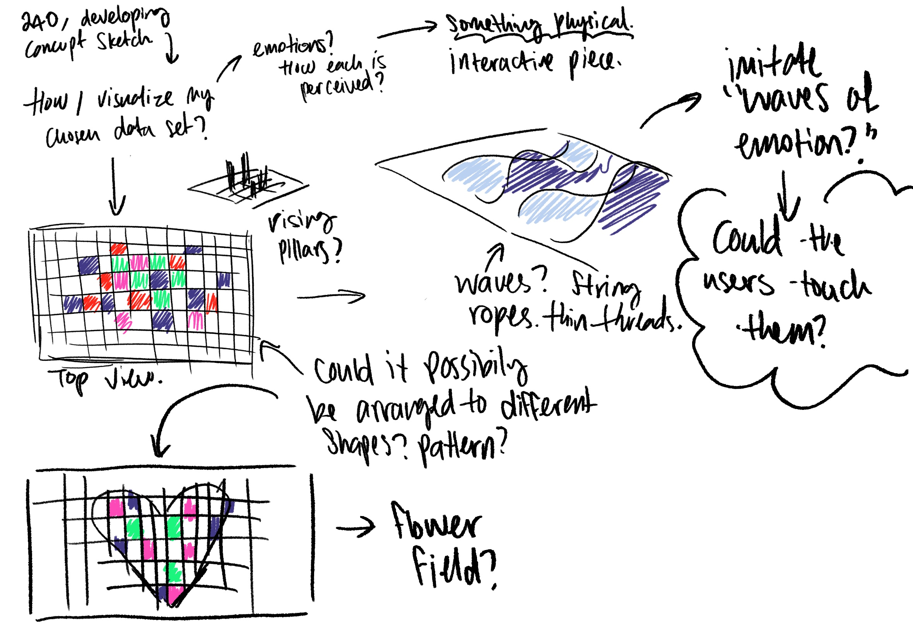
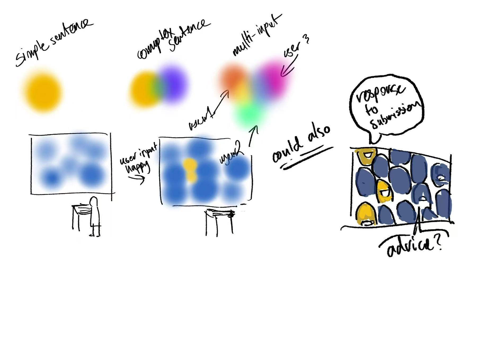
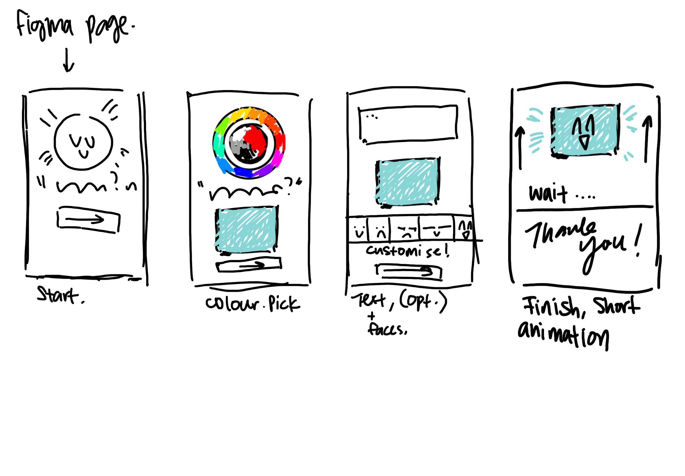

# Week 07

[← Back to Home](../index.md)

## Documentation 
## In class activities

1. Concept Sketches (30 mins)

Start by developing your concept sketch further, using drawing and annotation as a way of thinking through your project.

Display your sketch on your laptop screen or as a physical print/drawing. Circulate the room and leave post-it note responses on each other's work. For each sketch you visit, leave at least one observation (something you notice about the work) and one question (something you're curious about or unsure of).

Return to your own sketch and read through the responses you've received. Make notes on the comments: what surprised you, what aligned with your ideas, and what you want to follow up on.

Redraw or revise your sketch, using the responses to evolve your ideas. Document these developments for your journal entry.

2. Making Sprint (45 mins)

Using rapid prototyping — short cycles of iteration, focused making, and an experimental mindset — spend 45 minutes producing your first hands-on experiment with your dataset and visualisation approach.

Make something visible from your data, however rough. The goal is a testable thing, not a finished outcome.

Refer to your Week 6 skills roadmap to guide what you work on. Collect documentation for your journal as you go.

For the making sprint I wanted to make something that is useful for my project, Since I have something needed for color picking, I thought to use p5.js in order to make a color wheel. 

<iframe src="https://editor.p5js.org/ezha440/full/PgpsG3wj9" height= "400" width= "400"></iframe>

I used vibe coding for this just to get started. It did show up a wheel, but it didn't have the picker. And also scale wise it was a bit too big. 

<iframe src="https://editor.p5js.org/ezha440/full/wM87cP3Um" height= "400" width= "400"></iframe>

So I redid this, the second variation is on a much smaller scale. Also have a box on the bottom which shows what color is picked from the wheel. This seems the most ideal and is closer to what I imagine the project needs. 

3. 'What if' Variations (45 mins)

In pairs, share the outcome of your Making Sprint. Walk your partner through what you made, what you were trying to achieve, and where you ended up.

Your partner will then propose three 'what if' variations: alternative and provocative directions your project could take. The aim is to encourage critical, speculative, and experimental thinking.

I was suggested what if I had the option to make this more interactable？

Choose one of the variations your partner proposed and produce a drawing or plan that explores this direction. Include notes and annotations to explain how it differs from your current approach and what it might open up for your project. Document this for your journal entry.

## Independent Study

1. Project Development & Skill Building

Continue developing your project, building directly on the outcomes of today's Making Sprint and 'What if' Variations. As you work, address the technical skill gaps identified in your Week 6 roadmap. Document your learning alongside your making processes, including both textual and visual evidence. Reflect on what you tried, what you learnt, and how this has moved your project forward.

I want to start with a figma, 

2. Progress Report

Prepare a short, 5-minute progress report to share with a small group in next week's class. This should take the form of a simple slideshow (around 5 slides), covering:

**where your project currently stands**

I want to design and prototype an interactive installation for the Auckland Art Gallery that invites users to make a unique, in-the-moment contribution, a colour and a few words expressing their current feeling. Which is then anonymised and projected onto a shared public screen. The work is not a tool for personal reflection or clinical observation, but rather a space where each user's single, unrepeated contribution becomes raw material for a collective, ever-changing emotional portrait of the public.

**Data source:**

It would be self- input, so the bottom line would be that my data comes directly from what the user voluntarily tells me about their own emotional state, in the moment or near the moment, through simple, low-friction inputs that feel more like a mirror than a measurement.
key developments and decisions so far

**Personal drive:**

I wanted to make something that treated emotional expression as public, fleeting and collective, not private. A space that allows the user to vent, to express their current emotion, where the only thing asked of you is a colour and a line, projected and then gone. I want to make that space because it’s the kind I want to exist in. 
.jpg)

Here’s a mock-up environment I did with the inside of the art gallery space.

By the entrance, there will be a short description and a QR code next to it, which will then lead to the application thats connected to the projector. 

**visual research/references**
The Obliteration Room by Yayoi Kusama, rain room, by random international, Text Rain, Camille Utterback. 

**What I have done so far**

- mocked up my idea 
- have some research 
- a clear path to follow

Checkpoints/ what I want to work on next 

- Making the interface interactable 
- Do more research 
- Privacy issues...what can I do to prevent that? 

**Two or three specific questions you want feedback on:**

What is the single most unclear or underdeveloped part of the experience?

Looking at my Figma mock-up, is there anything that could be done better? is anything confusing ?

What's the one thing I should prioritize next week?

What can I do better in general?