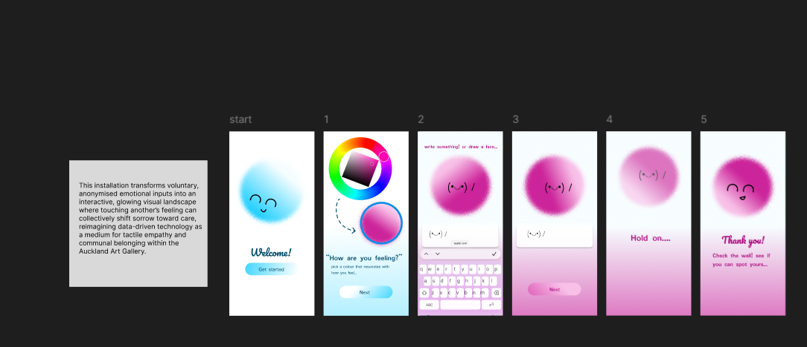
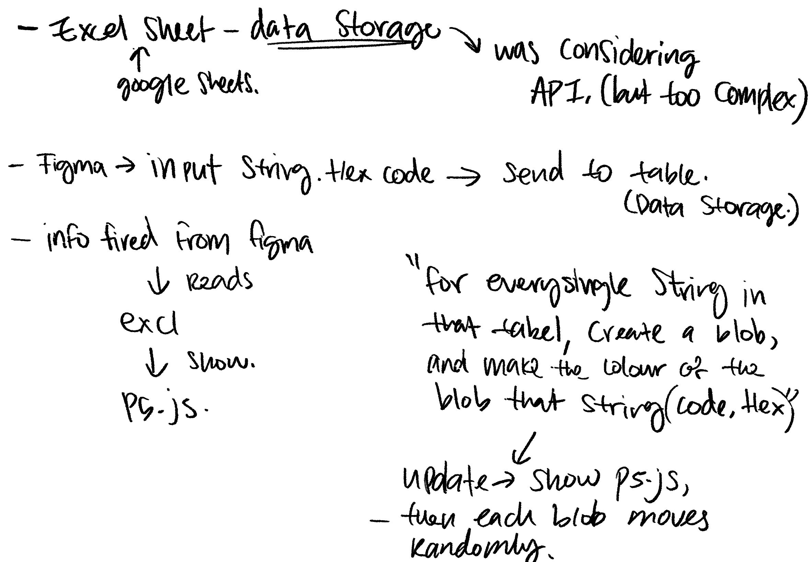

# Week 09

[← Back to Home](../index.md)

## Documentation 
1. Project Statement: First Draft

For in class activity, we looked at Xeno computer case studies together with a peer. Answering these questions: 
- What are the data sources used in this work?
- What is the future scenario it addresses?
- What does the statement argue about data and power?
- What might be the intended impact, and is this included in the statement?

After this, we started on a first draft for the project proposal, using NotebookLM. I added sources that would help me generate my report. 

These include my Reflective Proposal, journal entries for weeks 7 & 8, practitioner references from weeks 7 & 8, data source documentation or links and I also added some sketches to it because why not. 

I then generated the statement using the example on the class slides. 

CONTEXT: I am a designer developing a data-driven visualisation for public display. The sources provided are from my project journal, documenting experiments, technical learning, conceptual development, and visual research.

TASK: Using only information from these sources, draft a project statement for a general public audience.

The statement must address each of the following:

What the visualisation is

The data source(s) used

The subject matter and future scenario

How the work engages critically with ideas about data representation

The intended impact on a public audience

FORMAT: Write in first person. Use clear, direct language appropriate for exhibition wall text. Aim for 300 words. Write in continuous prose without headers or bullet points.

IMPORTANT: Draw only from information in the provided sources. If any of the five elements above are unclear or underdeveloped, note this briefly at the end rather than inventing details.

**Here is the response I got back:**

I invite you to contribute to a collective emotional portrait of our community. This interactive installation is a data-driven visualisation that transforms individual feelings into a shared, ever-changing public display within the Auckland Art Gallery. By selecting a specific colour and a few words to express your current state, you provide the raw material for a large-scale projection that reflects the "chromatics" of the human psyche.

The data source for this work is entirely voluntary and self-reported. I have designed the interface to facilitate low-friction, in-the-moment contributions that function more like a mirror of your sentiment than a clinical measurement. Once you submit your feeling, it is anonymised and merged into a digital landscape of overlapping, glowing forms.

Through this work, I am exploring a scenario where our relationships to one another and our environment are increasingly mediated through technology. I want to engage critically with how we represent human data, shifting it from a sterile set of statistics into a space for "tactile empathy". By introducing sensory inputs like touch and drag, the visualisation becomes an interactive landscape where you can "pat" a colour blob representing sadness to offer a form of indirect support, helping to shift it toward a happier state.

My intended impact is to move beyond personal reflection and create a space for collective connection. I hope that by seeing your own emotions as part of a broader visual field, you feel a sense of belonging to a larger whole. This work is an invitation to witness a living record of our public sentiment and to experience how technology can be used to foster communal care and understanding.

***

**Note on underdeveloped elements:** The "future scenario" is not explicitly defined as a specific time or fictional setting in the sources; it is framed conceptually as a response to the increasing role of technology in mediating human relationships.

While reading through this, I didn't think it was too bad. It's nicely worded, It mentions the lack of future scenario, which is something I should be focusing on. Something that feels generalized is the words used to type this out. The flow just doesn't feel humane and it added a few "keywords" in from my souces. 

Things I need to work on: 
- have a clear future direction 
- clearify what the project is for after pivoting? (I feel like it's just very generalized still..)

one sentence that commits the direction of my project is:

**“This installation transforms voluntary, anonymised emotional inputs into an interactive, glowing visual landscape where touching another’s feeling can collectively shift sorrow toward care, reimagining data-driven technology as a medium for tactile empathy and communal belonging within the Auckland Art Gallery.”**

With peers, I shared my draft proposal and most also brought up the issue with the lack of future scenario. 

I worked on this briefly and put it into one sentence.

**"A city where public areas serve as emotional mirrors, enabling strangers to use touch-driven digital interfaces to silently perceive, acknowledge, and gently influence each other's inner states, turning anonymous crowds into welcoming, sympathetic micro-communities without the need for verbal communication or the loss of personal privacy."**

2. Making Sprint

Before beginning, take 10 minutes to plan your sprint. Draw on your draft project statement and the feedback you received. Identify what your project most needs right now: what will you develop and test? Set specific goals and consider what tools and materials you will need.

Use the next 35 minutes to make focused progress on your project. Work towards your specific goals. The aim is to produce a testable thing, not a finished outcome. Address the challenges most relevant to your current direction, and collect documentation for your journal as you go.

For my sprint, currently I think the main problem as adding a functional colour wheel into figma. I have tried making it into a component on figma, but it didn't have the effect I wanted. So I want to look at adding a p5.js. For faster results, I went and used vibe coding. 

I have dones similar sprints in the previous weeks, so I continued and refined. 

<iframe src="https://editor.p5js.org/ezha440/full/bYQ6WT6HT" height= "400" width= "400"></iframe>

Lastly, this is the one I am most happy with, it's small enough, with the hex box on the bottom and not super laggy. although the colours look less saturated. I don't think it's a huge problem. 

3. Round Robin Rapid Reactions

Besides this, I also showed my figma prototype from last week, since I ran out of time trying to plug it into figma. I thought to just showcase that. I copied my proposal sentence in and had a showcase. 

Once it started (since I'm presenting first) I had peers speculate, and some questions they have proposed raised concerns in me. 

Some couldn't tell exactly what this is for. It looks just like an UX that allows the user to pick colour and type something. Another raised concern that they simply just don't understand. I had to go in and explain it better which I think is a failure on my part. This is definitely something I need to work on better. (I also had issues with my data set, since it is self-reported, how can I make sure it's confidencial?)

Besides this, I was also asked to explain what my final outcome would be. Afterwards I was brought up concerns on this being unrealistic due to time constrights and also the lack of materials or tools I would have access to. I was also brought up a point to pivot, maybe look at into the basics of what my project is (is there a possible way to use different tools? Do you have to have project this using a projector?)

After consulting a few peers for more feedback (along with the lecture), I have chosen to break down my current project to its basics. 

Figma(which acts like a collector) --connect--google sheets(which holds collected data and live updates)--connect-->p5.js sketch (Updates with the live data) --optional project it onto a bigger screen (like a tv) or just the laptop screen is fine. 

## **Independent Study** 

1. Project Development

Continue developing your project, building directly on the outcomes of this week's Making Sprint and the reactions you received during the Round Robin Rapid Reactions. Refine your project statement alongside your making. Document your progress, including both textual and visual evidence. Reflect on what you tried, what you learnt, and how this has moved your project forward.

2. Progress Report

Prepare a short, 5-minute progress report to share with a small group in next week's class. This should take the form of a simple slideshow (around 5 slides), covering:

Overview of my progress report (condensed)

**where your project currently stands**

I’m currently pivoting to a new idea

- Figma (my app mock-up from last week) --> updates live data input into a Google Sheets (self-report data source) 
- The data collected would be all the colours (hex strings) along with extra text inputs (optional) 
- The Google Sheets would then be live updated into a p5.js drawing, converting the hex strings into colour blobs.
- Which then the p5.js file would be connected/ projected onto a wider screen, so users can see exactly how it updates 

I have a clear direction I want to work toward, but I'm having trouble following through. 

- Lack of skills
- time constraints 
- testing out something new/ experimenting  

**your current draft project statement**

This interactive installation is a data-driven visualisation that transforms individual feelings into a shared, ever-changing public display.

By selecting a specific colour and a few words to express your current state, you provide the raw material for a large-scale projection that reflects the "chromatics" of the human psyche.

The data source for this work is entirely voluntary and self-reported. I have designed the interface to facilitate low-friction, in-the-moment contributions that function more like a mirror of your sentiment than a clinical measurement. Once you submit your feeling, it is anonymised and merged into a digital landscape of overlapping, round forms (blobs) 

**key developments and decisions since Week 8**

The previous Idea I had was somewhat unrealistic within the time frame given and also the lack of materials I have access to if I do go through with it. My newer idea is to focus on making the basics of the original work. 

**visual research/references**

I looked into some sources to help me work on the development, 

https://awesome-table.com/connectors/help/export-to-google-sheets/figma/export 

To send data back and forth between Figma and Google Sheets, you can use specialized plugins.

https://www.youtube.com/watch?v=EU7SvAyybOE&t=64s 

To get p5.js to read data from an Excel sheet, the most common and efficient method is to export the Excel file as a CSV and use the built-in loadTable() function. 

How will Figma live update the data into the spreadsheet?

https://www.youtube.com/watch?v=odONMaXerQQ&t=75s 

https://www.youtube.com/watch?v=mSztdtmZ7FQ

Two or three specific questions you want feedback on
Come to class ready to present and to receive feedback from peers and teachers.

