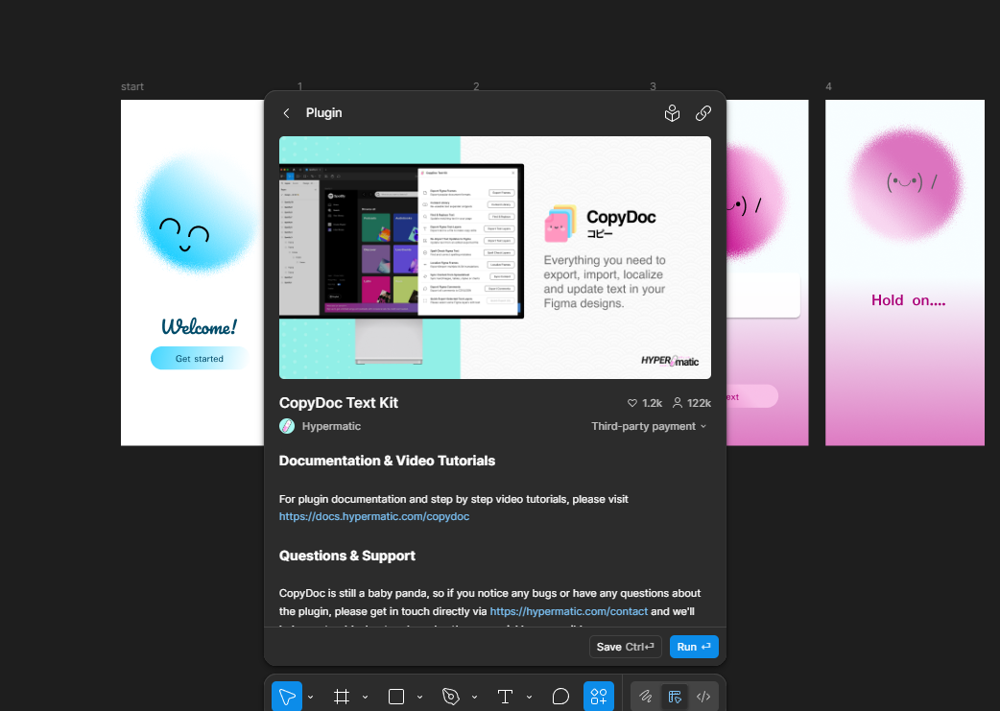

# Week 10

[← Back to Home](../index.md)

## Documentation 
1. Progress Reports

Share your progress report slideshow with a small group of peers. Before presenting, make sure your feedback questions are clearly communicated so the group can respond to them directly.

Each person has 5 minutes to present, followed by group discussion and feedback. Assign the roles of Chair, Technical Commenter, and Conceptual Commenter for each presentation, rotating roles after each presenter. Post comments to the presenter's card on your group's Padlet boardLinks to an external site. across the four feedback columns. Record the feedback you receive for your journal entry.

Review the cards on your group's board and add any further comments or suggestions not raised during the live critique.

In class, We had another progress check with our peers and had written reviews on Padlet. 

Here is the feedback I have received. 

2. Gallery Walk

Visit the other groups' Padlet boards (you can access these via the main class Padlet boardLinks to an external site.). Browse their Technical and Conceptual feedback cards, and add a comment or suggestion of your own via "+ Add comment" or "+ Post". Use the heart (like) button to upvote the most helpful advice.

3. Action Plan

Drawing on the feedback from the critique session, write a short reflective summary for your journal (around 250 words). Identify the most significant feedback and ideas you encountered, and establish clear, concrete action points to develop your project.

There hasn't been a major pivot in my project direction, rather, I've focused on clarifying how I will technically achieve the final outcome. Feedback was minimal, but one critical question emerged. Do you have a backup plan if the original technical approach fails?

My original plan establishes a three-part data pipeline: Figma serves as the interface where participants select a colour and enter a few words to express their feeling. That input connects to a Google Sheet, which acts as the live database. From there, a p5. js script reads the sheet and generates the real-time visualisation. A large-scale projection of overlapping, glowing forms that collectively maps our community's emotional "chromatics"

However, I recognise that Figma's native capabilities for writing to external databases are limited. API latency or authentication hurdles could break the chain. Therefore, my backup plan, shaped by peer feedback, replaces Figma with a Google Form. Participants would still choose a colour and describe their state, but the submission would flow directly into the same Google Sheet without requiring Figma. The p5.js script would then read from the sheet identically, preserving the installation's core experience.
This backup maintains the low-friction, anonymised, voluntary data model while reducing technical risk. It sacrifices some interface customisation for reliability, ensuring the collective emotional portrait remains the priority, not the fragility of the toolchain.

## **Independent Study** 

Project development is the sole focus of this week's independent study. Make use of the critique session and the action plan developed from class to guide your work.

Document your progress, including both textual and visual evidence. Reflect on what you tried, what you learnt, and how this has moved your project forward. Keep in mind that you have two weeks to complete the project for the showcase in week 12.

From this, I focused on looking into possible ways to plug in figma and connect it to google sheets. From my research I found that It is possible with a plug in.

However, the more I tested the more I realized this isn't what I wanted. The plugin allowed me to sync the data from the sheets to figma and not the other way around. I have yet to find a possible solution to this issue. Every research I have done is around the same results. 

I started looking for more solutions to this issue. I'm sure there are better solutions that would allow figma to do this (or even use a different interface) but this But with time running out, I figured I would just use the backup plan and change from figma to google forms. 

So I chose to pivot.

Giving up figma, I looked into using google forms. So its simply a QR code link to a google form 