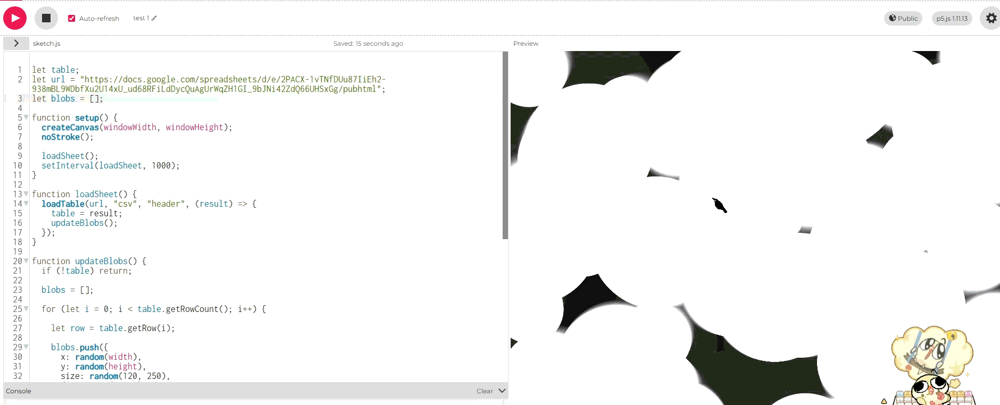
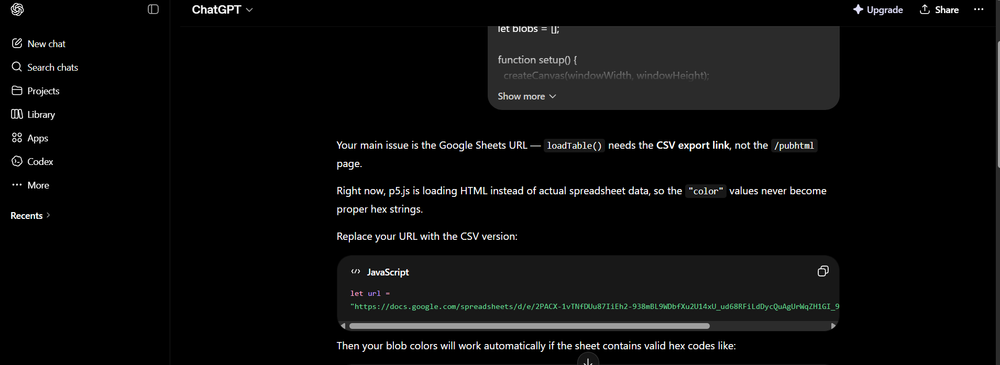
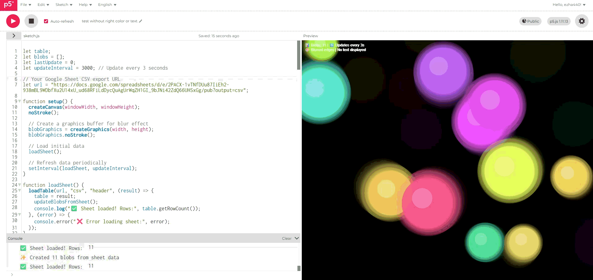
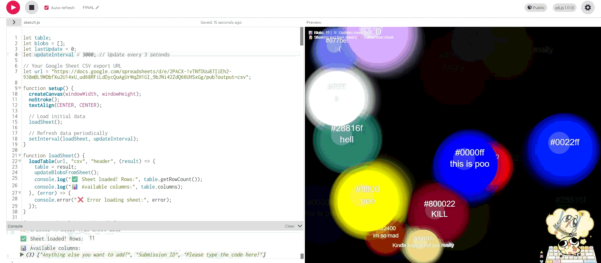
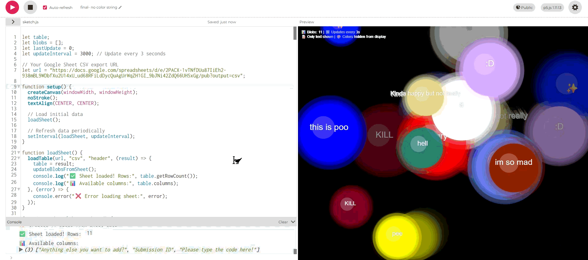

# Week 11

[← Back to Home](../index.md)

## Documentation 
1. Journal Review

Work in pairs. Using the Journal Checklist Download Journal Checklist, review your partner's journal entries for weeks 6–10, checking for clarity and completeness, an effective balance of visuals and text, and correct technical implementation. Share your observations with your partner.

Then re-read your own journal entries in preparation for the Studio Consultation. Identify three key moments (e.g. discoveries, challenges, decisions, feedback) that shaped your project direction. Write 1–2 sentences about each of these.

I have completed most of the blog entries at this point, but there are few things that I am lacking, I did went back in and refill them 

2. Practice Consultations

Work in pairs. Take turns interviewing each other using the question prompts on the class slides, following the same format as the Studio Consultation (10 minutes each). The interviewer should use the prompts as a guide rather than a script, ask follow-up questions, and let the conversation move between topics naturally.

Reflect on how you responded to the questions. Consider whether your answers were focused and coherent, and whether you were able to articulate how your work positions itself within broader ideas about data. Write 2–3 sentences about what you want to improve on, and keep these notes for your journal. Then find a new partner and repeat.

The feedback I have was helpful, I noticed I had the potential to go more into depth with the fourth question- How does your work challenge conventional ideas?- I could mention more of the social issues and how the future would look, why did I choose to do this? focus on that specific future? 

I certainly need more research, and rewrote my future scnario down to keep as a reminder. 

**"A city where public areas serve as emotional mirrors, enabling strangers to use touch-driven digital interfaces to silently perceive, acknowledge, and gently influence each other's inner states, turning anonymous crowds into welcoming, sympathetic micro-communities without the need for verbal communication or the loss of personal privacy."**

3. Showcase Planning

Add yourself to the showcase Miro boardLinks to an external site. and mark your preferred location to install your work. Coordinate with the class to agree on a plan. Use the board, along with Canvas/Discord/etc. Be ready to install your work at 2 pm on Friday 05 June.

## **Independent Study** 

I kept working on my project, at this stage I needed to test out the setInterval and loadTable function, 

The code connects to the google sheet by using loadTable function to fetch the sheet data as a CSV file every second (by setInterval), then it converts each row of the spreadsheet into a moving blob on the canvas. The loadTable function takes four parameters. the published google sheets URL, When the data successfully loads, it's stored in the table variable, and then updateBlobs is called, which loops through every row using table.getRowCount function and table.getRow(i), extracts the "color" and "text" values from each row using row.get("column name"), and creates a new blob object with random position, size, and movement speed. 

However. Something went wrong and my sketch has no coloured circles but full plain ones... 

Here's a gif for better reference, (I tried to plug in iframe but it just looked blank)

I don't know what went wrong. I have also double checked and fixed my google sheets when new answers/ inputs are put in, I realized that sometimes the collums would move and the hex strings would be shifted into the wrong place. This was an easy fix, but once refreshed, restarted the sketch didn't change and I couldn't figure out why. 

I was wasting away time at this point, I wanted to get this done as soon as possible. I went ahead and put it through AI to see what I did wrong. 

I prompt, "How could I make it so the blobs changes colours based on the hex string provided by the sheet source?" 

I knew that the url couldn't be the problem because I have seen it work. But it did mention that it's loading HTML instead of actual sheet data. So the color values was never proper hex strings. 

I tried the code that was given to me by Chatgpt for the blob updates. (trying something is better than nothing) But it didn't change much other than making the blobs more far apart and after a minute it would just disappear. 

I also wonder if it's because I didn't rename the row headers that why it wasn't picking up. 

Since I can't figure out how to make it color and connect, I just choose to vibe code the rest to get the effect I want. (openAI, 2026)

The issue with this is that it isn't connected to the sheet but having colour is a great start. 

I was so happy when this finally worked, it's connected to the google sheet and it shows up all the correct colors because of the hex strings. 

However I am thinking of just removing the string text just so I could have a much more closer representation of what I think the project would look lik. 

And that's my final display! 

I was went and put in more inputs for through the form, and waited for the load. It would roughly take about three minutes for it to upload to update, and the issue is because the connection with the form to to the sheets takes a while, I don't think there's much I can do since it's not related to the p5.js sketch. But for future projects I could look at using other programs.

Despite using vibe coding, I still make sure I understand how the function works 

So since the code is connected and linked to a google sheet, the program loads the spreadsheet as a CSV file and refreshes it every three seconds, allowing any changes made to the sheet to appear automatically on the canvas. and the code will also extracts text from the specific columbns, removes any color codes or names from displayed text using the stripColorCodes function, then looks for the colour info that can be used as the blob colours. (So in this case, I have hex codes, that's what the function picked up)

After this, I put my form into a QR code generator and downloaded it, ready for the showcase in week 12. 

## **Project Statement:**

**What if a city could feel with you?**

This visualisation invites you into a near-future Aotearoa, a city where public spaces act as emotional mirrors. Here, strangers never need to speak to understand one another. Instead, touch-driven digital interfaces allow people to quietly share how they feel. A moment of grief, a flicker of joy, a quiet anxiety. Without words, without identities, without the loss of personal privacy, anonymous crowds transform into welcoming, sympathetic micro-communities.
The floating, drifting blobs you see on this screen are not random. Each one represents a real person who scanned a QR code and answered a simple question about their current emotional state. That self-reported data flows directly from a Google Form into this living visualisation. The screen checks for new responses. As more people participate, more blobs appear, each one carrying only the emotional code someone chose to share, stripped of any identifying marks or colours they may have tried to add.

Rather than presenting data as fixed numbers, charts, or statistics, this work explores alternative approaches to data representation. Emotions are subjective, fluid, and often difficult to quantify. By transforming responses into organic, shifting forms, the visualisation challenges the assumption that data must be objective or precise to be meaningful. The movement, colour, and interaction of the blobs emphasise the human experiences behind the dataset, encouraging viewers to consider data as something lived and felt rather than merely measured.
The project critically engages with questions surrounding emotional surveillance, digital intimacy, and the ethics of sharing personal information in public spaces. While the future scenario proposes a more empathetic and connected city, it also raises questions about how emotional data might be collected, interpreted, and represented.

## **Reference**

loadTable. (2025). P5js.org. https://p5js.org/reference/p5/loadTable/

OpenAI. (2026). ChatGPT (May 29 version) [Large language model]. https://chat.openai.com/chat 